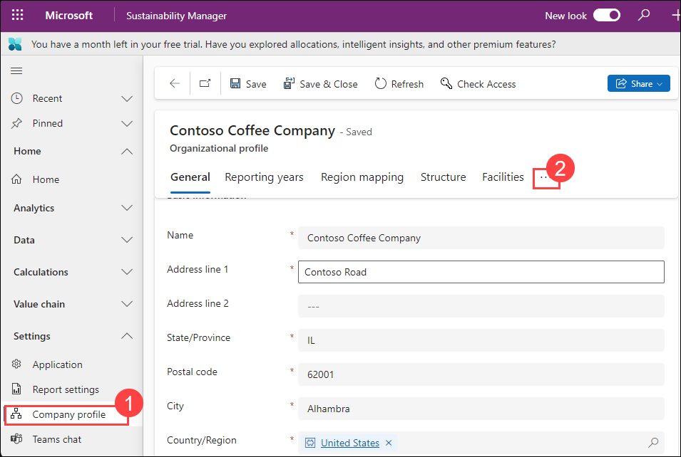
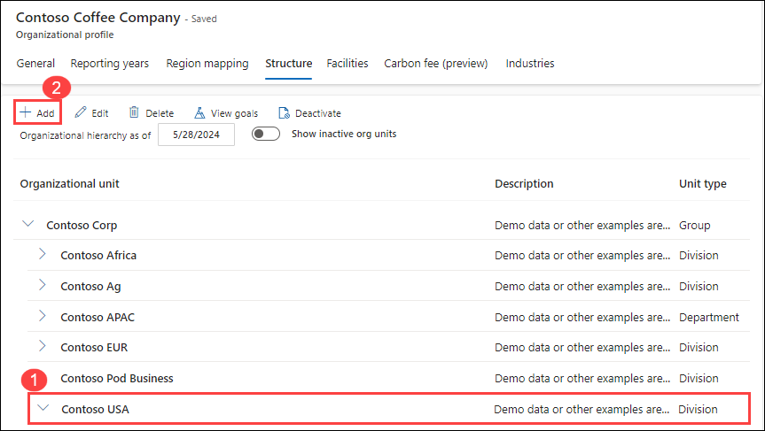
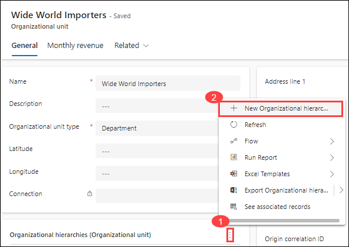
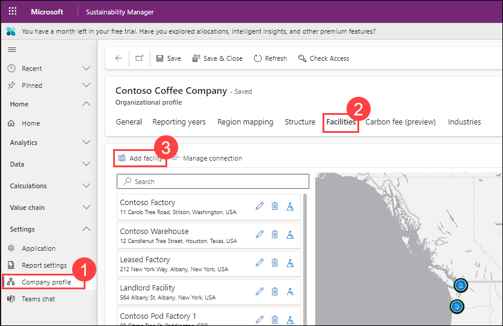
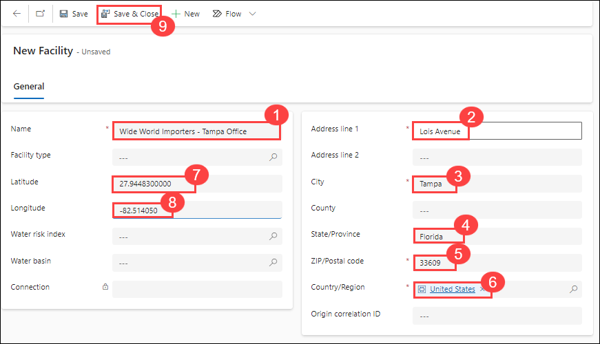
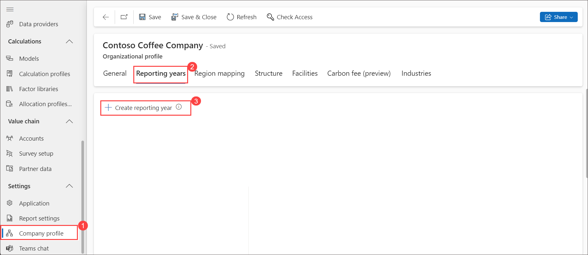

# Lab 2: Configure Microsoft Sustainability Manager 

##  Exercise 1: Prepare Business Units and Hierarchy  

### Task 1 : Prepare Business Units and Hierarchy  

In this task, you will set up the Company profile, hierarchy, and facilities for the Wide World Importers organization in Microsoft Sustainability Manager.

1. In the left navigation pane, Select **Company profile** under **Settings** .

1. The Company profile page includes basic information about the organization, such as name, address, company logo, the annual reporting period, and relevant industries. Additionally, there are tabs at the top of the page for setting up organization structure and facilities, both will be covered in this exercise.

   

1. On the **Company profile** page, select the **Industries** tab. Microsoft Sustainability Manager includes a selection of pre-defined industries and sub-verticals based on NACE standards, see NACE Code at https://nacev2.com/en. Select **+Add**.

   

1. Select **Transportation and storage**.

   

1. In the next screen, select **Land transport and transport via pipelines** and select **Add**.

   

1. **Land transport and transport via pipelines** is now visible in the **Industries** section at the bottom of the **Company profile** page.

1. In the **Company profile** page, switch to the **Structure** tab.

   

1. Select **Contoso USA** and select **Add** to add a new organizational unit under it.

   

1. Enter the following data for organizational unit and select **Save** in the button pane:

    * **Name**: Wide World Importers
    * **Organizational unit type**: Department

      

1. In the **Organizational hierarchies** section, which appears after selecting **Save**, select **+ New Organizational hierarchy**.

    

1. Set the following values and select **Save & Close**:

    * **Parent**: Contoso USA
    * **Effective start date**: The first day of the current month (MM/DD/YYYY)

      

1. After being returned to the **Organizational Unit**, select **Save & Close** to return to the **Company profile**.

   

1. If necessary, navigate to **Company profile**, switch to the **Facilities** tab page and select **Add facility**.

   

15. Create a new Facility with the following details. Once the values are entered, select **Save & Close**:

    >**Note:** Pay close attention to the data used in this lab. The following labs will reference this data, and it will need to match exactly as seen in the lab.

    1. **Name**: Wide World Importers - Miami Office
    1. **Address line 1**: Brickell Avenue
    1. **City**: Miami
    1. **State**: Florida
    1. **Zip**: 33132
    1. **Country**: United States
    1. **Latitude**: 25.774320
    1. **Longitude**: -80.187720

>**Note:** Latitude and Longitude are not required but are used to display a pin on the Facilities map. They can be automatically added by selecting an address from the autocomplete options in Address line 1, or manually entered.

   

17. Using the same steps, add another new **Facility**. Once the values are entered, select **Save & Close**.

    >**Note:** Pay close attention to the data used in this lab. The following labs will reference this data, and it will need to match exactly as seen in the lab.

    1. **Name**: Wide World Importers - Tampa Office
    1. **Address line 1**: Lois Avenue
    1. **City**: Tampa
    1. **State**: Florida
    1. **Zip**: 33609
    1. **Country**: United States
    1. **Latitude**: 27.944830
    1. **Longitude**: -82.514050

>**Note:** Latitude and Longitude are not required but are used to display a pin on the Facilities map. They can be automatically added by selecting an address from the autocomplete options in Address line 1, or manually entered.

   

Great job, by completing these steps, you have completed the organizational setup in Microsoft Sustainability Manager for Wide World of Importers. This included the Company profile, hierarchy, and facilities. Organizational structure and facility management will be linked to activity and emission data to group emissions by Organization, facility, and even regions. This is an important part of carbon emission reporting and organization disclosures. **Please continue to the next task.**

## Task 1.2 : Set up reference data

In this task, Reed will set up the reference data for contractual instrument types in Microsoft Sustainability Manager. Contractual instrument types are different types of contractual agreements that a firm has with their providers and suppliers.

1. In the left navigation pane, select Data > Reference data.

2. Select Contractual instrument types and then select View.

    

3. Under Active contractual instrument types, select + New to create new contractual types.

4. Create a new contractual instrument with the following details and then select Save & Close.

      - Name - VanArsdel Ltd
      
      - Energy source - Nuclear

        

5. In the same way, create a new contractual instrument with the following details and then select Save & Close.

      - Name - Adatum Corp
      
      - Energy source - Other

        
   
    By completing these steps, you've added contractual instrument types.
 
Many types of reference data are available. You can explore the other reference data types, which will be used throughout Microsoft Cloud for Sustainability and Microsoft Sustainability Manager.

## Task 1.3 : Set up unit conversion factor

In this task, Reed will set up a unit conversion factor in Microsoft Sustainability Manager. While Alex is reviewing the inventory management plan, Alex identifies a missing unit of distance that's needed to calculate emissions for the fleet of electric vehicles. Alex asks Reed to add a new unit to the Length/Distance unit group.

You can use unit groups to group units together and define a base unit that you can use to convert unit types. For example, the Length/Distance unit group contains units for length and distance, with a base unit of meter (m). The units within the Length/Distance unit group have conversions between the unit type and meter, such as miles convert to 1,609.344 meters.

1. From the left navigation pane expand **Settings** and select **Application** > the choose the **Unit groups** from the menu bar. Under Active unit groups, select Length/distance and then open it.

    

2. Scroll down and select + New Unit to create a new unit.

   

5. Enter the following details for the new unit and then select Save & Close.

     - Name - 100 mile
      
     - Conversion factor - 160934.40

       
       
By completing these steps, you've finished the organizational and reference data setup.

Organization and reference data is the foundation for Microsoft Cloud for Sustainability and Microsoft Sustainability Manager. This data is used throughout the tools, so make sure that your organization and reference data is set up correctly.

## Task 1.4 : Create a reporting year

Alex and Reed will set up the reporting years in Microsoft Sustainability Manager. Alex will name the reporting year, set up the start date and use a template to create more than one period.

1. In the left navigation pane, select the **Settings** > **Company profile** then select the Reporting years tab and choose Create reporting year.

   

4. Enter the following details. After you've entered the values, select Save.

      - Name - Enter Fiscal - 2022.
      
      - Start date: 01/01/2022.
      
      - Year template - Annual.

      

   >**Note**: This name appears on the Insights page in Microsoft Sustainability Manager.

5. Select Close. The reporting year will generate with the first period starting on the Start date and the last period ending one year from the Start date.

## Task 3 : Access/Permissions 

 In this we'll be adding User to Sustainability trial environment and we'll be assisgning security role to user1. 

1. Fetch User1 email address by navigating to **Environment details** tab.

2. Open InPrivate Windown. Go to the [Microsoft Sustainability Manager free trial page](https://dynamics.microsoft.com/en-us/sustainability/sustainability/free-trial/)

1. On the **Let's get started** page, enter the  User1 email which you copied in first step and select the checkbox and click on **Start your free trial**

   

1. Follow the on-screen guidance to provide the contact details and click on **Submit**

   

1. You will be redirected to the Sustainability Manager page, where you can start using the trial version of Microsoft Sustainability Manager.

   

1. In edge browser for https://admin.powerplatform.microsoft.com/ and login with odl_user account.

1. From the left navigation pane select **Environment** and **Sustainablity trail**.

1. Select **Settings** from menu bar then expand **Users + Permissions** and click on **Users**.

1. Select **+ Add Users** from left top menu bar and on the **Add user** window search for User1 and click on **Add**. 

1. On the **Manage security roles** blade select the **Basic User** and **Sustainablilty all - reports - full access Role**.

1. Click on **Save**. 
