# Lab 2: Configure Microsoft Sustainability Manager 

## Lab Overview

As an environmental consultant for Wide World Importers, we need to configure the organizational structure within Microsoft Sustainability Manager. This includes setting up the company profile, defining the organizational hierarchy, and adding facilities. These steps will help you categorize and manage sustainability data accurately, supporting your organization's efforts in carbon emission tracking and reporting for the Wide World Importers organization.

## Lab Scenario

In this lab, you will set up the company profile, organizational hierarchy, and facilities for the Wide World Importers organization in Microsoft Sustainability Manager. This includes adding industry classifications, creating organizational units, and defining facilities to ensure a structured and comprehensive setup for carbon emission tracking and reporting.


## Lab Objectives
In this lab, you will complete the following tasks:

- Task 1 : Prepare Business Units and Hierarchy  
- Task 2 : Set up reference data
- Task 3 : Set up unit conversion factor
- Task 4 : Create a reporting year
- Task 5 : Access/Permissions

## Estimated timing: 60 minutes

### Task 1 : Prepare Business Units and Hierarchy  

In this task, you will set up the Company profile, hierarchy, and facilities for the Wide World Importers organization in Microsoft Sustainability Manager.

1. In the left navigation pane, expand **Settings (1)** and select **Company profile (2)**.
   
    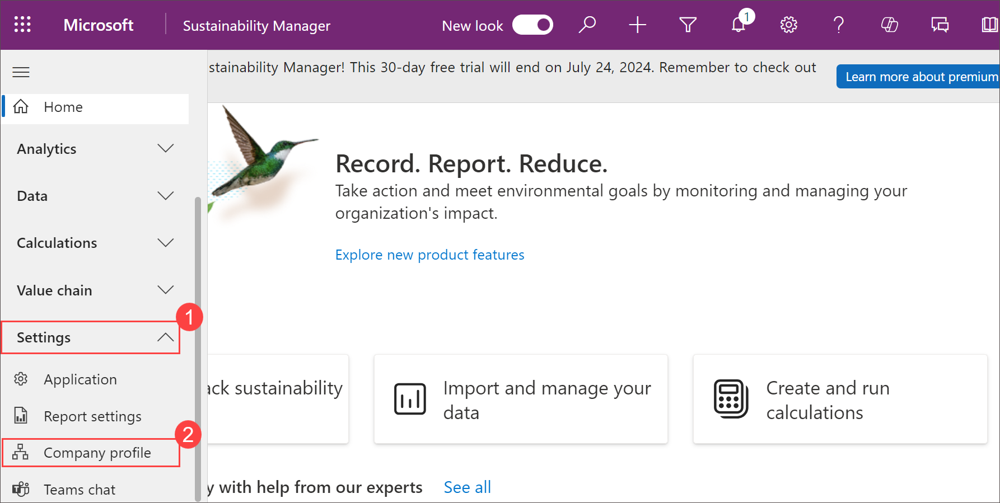
    
1. The Company profile page includes basic information about the organization, such as name, address, company logo, the annual reporting period, and relevant industries. Additionally, there are tabs at the top of the page for setting up organization structure and facilities, both will be covered in this exercise.

1. On the Company profile page, navigate to the **Industries (1)** tab and click on **+ Add (2)**.

   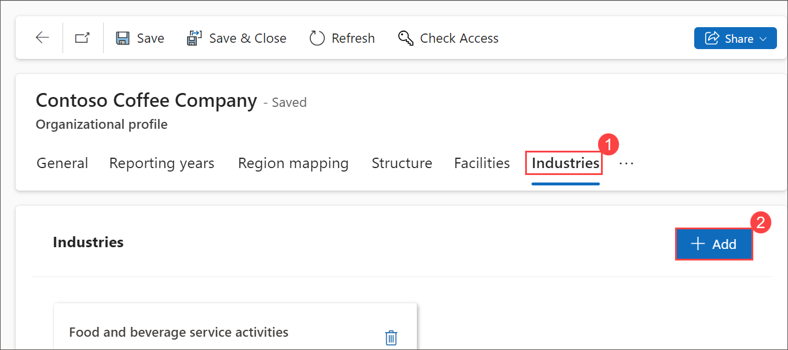

1. Choose **Transportation and storage (1)**, then select **Land transport and transport via pipelines (2)**, and finally, click on **Add (3)**.

    
   
    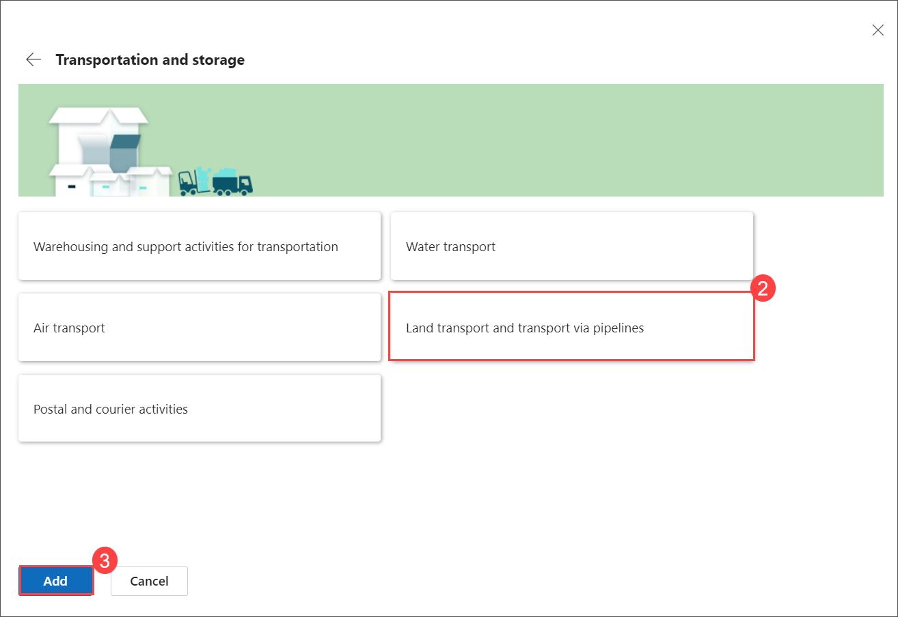

1. You will notice that **Land transport and transport via pipelines** is now listed in the **Industries** section at the bottom of the **Company profile page**.

      
      
1. On the **Company profile** page, switch to the **Structure (1)** tab, expand **Contoso Corp (2)**, then select **Contoso USA (3)** and click on **+ Add (4)** to create a new organizational unit under it.

    .png)

1. Enter the following data for organizational unit and select **Save (3)** in the button pane:

    * **Name**: **Wide World Importers (1)**
    * **Organizational unit type**: **Department (2)**

      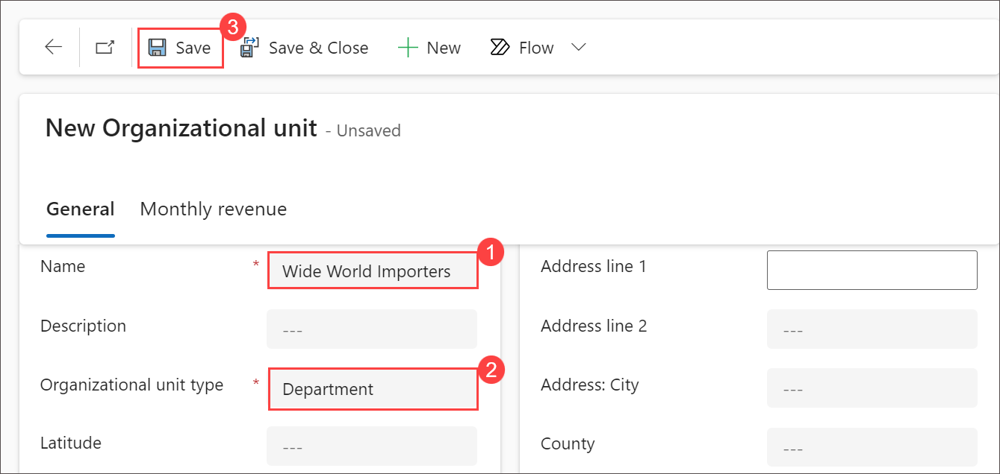

1. In the **Organizational hierarchies** section (you may need to scroll down), select the **three ellipses (1)** option, and then choose **+ New Organizational hierarchy (2)** from the list.

     

1. Set the following values and select **Save & Close**:

    * **Parent**: Please delete the current entry, then use the **search** icon to select **Contoso USA**.

    * **Effective start date**: The first day of the current month **(MM/DD/YYYY)**

      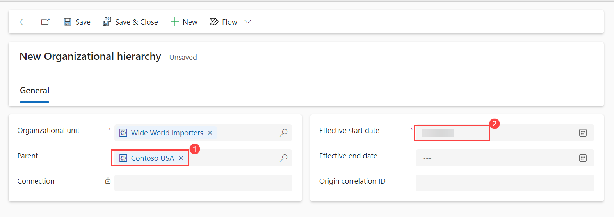

1. After being returned to the **Organizational Unit**, select **Save & Close** to return to the **Company profile**.

   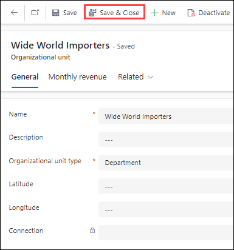

1.  Return to the **Company profile** page, navigate to the **Facilities (1)** tab, and then click **Add facility (2)**.

    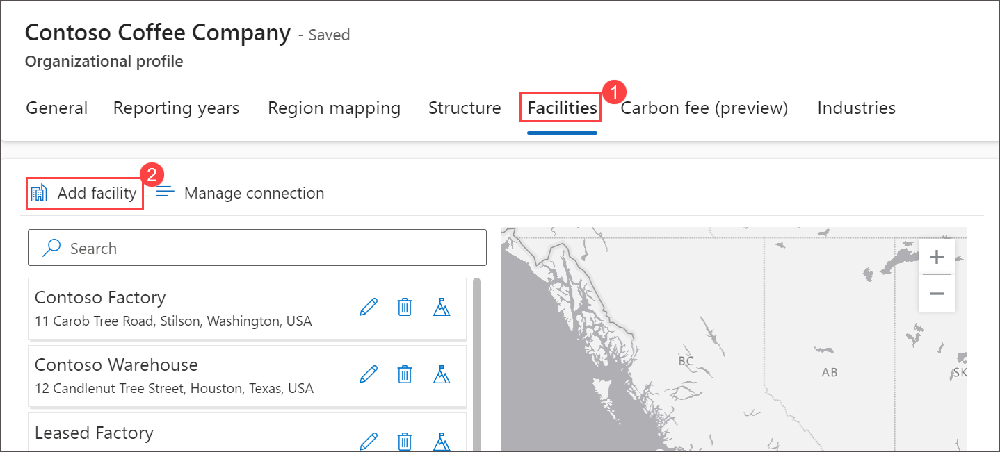

1. Enter the following details to create a **new facility**, then click **Save & Close**:

    >**Note:** Pay close attention to the data used in this lab. The following labs will reference this data, and it will need to match exactly as seen in the lab.

    1. **Name**: Wide World Importers - Miami Office
    1. **Address line 1**: Brickell Avenue
    1. **City**: Miami
    1. **State**: Florida
    1. **Zip**: 33132
    1. **Country**: United States
    1. **Latitude**: 25.774320
    1. **Longitude**: -80.187720

    
    
    >**Note:** Latitude and Longitude are not required but are used to display a pin on the Facilities map. They can be automatically added by selecting an address from the autocomplete options in Address line 1, or manually entered.

1.  Navigate to **Company profile**, switch to the **Facilities** tab page and click on Add facility..

    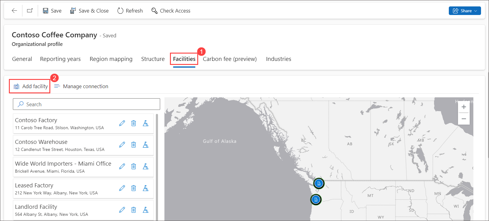

1. Using the same steps, add another new **Facility**. Once the values are entered, select **Save & Close**.

    >**Note:** Pay close attention to the data used in this lab. The following labs will reference this data, and it will need to match exactly as seen in the lab.

    1. **Name**: Wide World Importers - Tampa Office
    1. **Address line 1**: Lois Avenue
    1. **City**: Tampa
    1. **State**: Florida
    1. **Zip**: 33609
    1. **Country**: United States
    1. **Latitude**: 27.944830
    1. **Longitude**: -82.514050

     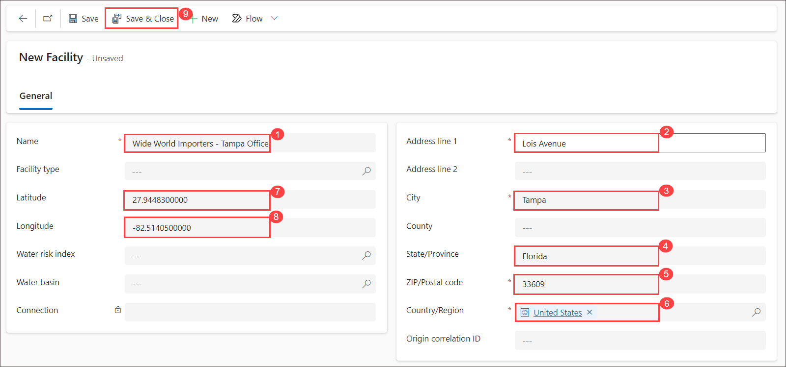
    
      >**Note:** Latitude and Longitude are not required but are used to display a pin on the Facilities map. They can be automatically added by selecting an address from the autocomplete options in Address line 1, or manually entered.

Excellent work! By finishing these steps, you have successfully set up the organizational framework in Microsoft Sustainability Manager for Wide World of Importers. This encompassed establishing the Company profile, hierarchy, and facilities. The organizational structure and facility management will play a crucial role in linking activity and emission data, facilitating the grouping of emissions by Organization, facility, and regions. This integration is essential for accurate carbon emission reporting and organizational disclosures.

## Task 2 : Set up reference data

In the task You'll set up reference data by adding contractual instrument types used to manage agreements with providers and suppliers. This ensures data accuracy and standardization for sustainability reporting, meeting organizational requirements.

1. Navigate to **Data (1)** in the left navigation pane, then select **Reference data (2)**, and click on **View (3)** next to **Contractual instrument types**.

    

1. Select **+ New** to create new contractual types.

   

1. Create a new **contractual instrument** with the following details, and then click **Save & Close (3)**:

      - **Name** - **VanArsdel Ltd (1)**
      
      - **Energy source** - **Nuclear (2)**

        

1. In the same way, create a new **contractual instrument** with the following details, and then select **Save & Close (3)**

      - **Name** - **Adatum Corp (1)**
      
      - **Energy source** - **Other (2)**

        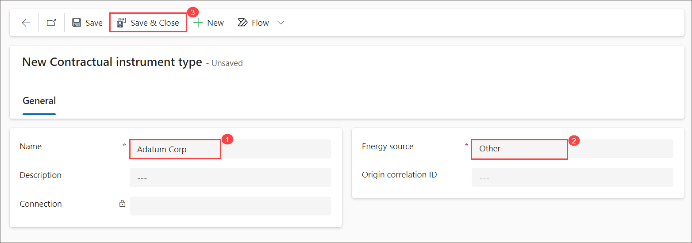
   
        >**Note**: Many types of reference data are available. You can explore the other reference data types, which will be used throughout Microsoft Cloud for Sustainability and Microsoft Sustainability Manager.

## Task 3 : Set up unit conversion factor

In this task, we will establish a unit conversion factor in Microsoft Sustainability Manager, which is essential for calculating emissions for our fleet of electric vehicles.

Unit groups allow you to organize units and define a base unit for converting between different unit types. For instance, the Length/Distance unit group includes units like meters (m) and miles, with a conversion factor where 1 mile equals 1,609.344 meters.


1. Expand **Settings (1)** in the left navigation pane, then select **Application (2)**. Next, choose **Unit groups (3)** from the menu bar. Under **Active unit groups**, select **Length/distance (4)** and open it.

   

1. Scroll down and click on **+ New Unit** to create a new unit.

   

1. Enter the following details for the new unit, and then click **Save & Close (3)**

    - **Name** - **100 mile (1)**
      
    - **Conversion factor** - **160934.40 (2)**

       
       
     >**Note**: Organization and reference data is the foundation for Microsoft Cloud for Sustainability and Microsoft Sustainability Manager. This data is used throughout the tools, so make sure that your organization and reference data is set up correctly.

## Task 4 : Create a reporting year

In this task, we will be setting up the reporting years in Microsoft Sustainability Manager and name the reporting year, set up the start date and use a template to create more than one period.

1. Navigate to **Settings** in the left navigation pane, then select **Company profile (1)**. Click on the **Reporting years (2)** tab, and choose **Create reporting year (3)**.

    

1. Enter the following details. After you've entered the values, select **Save**.

      - **Name** : Enter **Fiscal - 2023**.
      
      - **Start date** : **01/01/2023**.
      
      - **Year template** : **Annual**.

      
   
1. This name will be displayed on the Insights page in Microsoft Sustainability Manager.

     

1. Click Close. The reporting year will be generated, with the first period starting on the Start date and the last period ending one year from the Start date.

## Task 5 : Access/Permissions 

In this task, you'll assign specific roles and permissions to user, ensuring they have the appropriate access to Microsoft Sustainability Manager features necessary for their responsibilities. This ensures secure and efficient use of the platform.

1. Use the below link to access the trial version of Microsoft Sustainability Manager.

   ```
    https://dynamics.microsoft.com/en-us/sustainability/sustainability/free-trial/
   ```

1. Please use the following credentials to start a free trial of Sustainability Manager for Alex Wilber.

    - **Email/Username:** <inject key="User 01 UPN"></inject>
    
    - **Password:** <inject key="AzureAdUserPassword"></inject>

1. On the **Let's get started** page, enter the <inject key="AzureAdUserEmail"></inject> and select the checkbox and click on **Start your free trial**.

   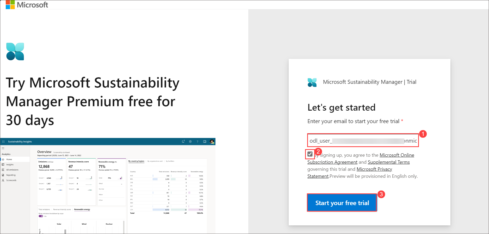

1. Follow the on-screen guidance to provide the contact details and click on **Submit**.

   

1. close the tab.

1. In the Edge browser, navigate to https://admin.powerplatform.microsoft.com/ and log in with the following credentials:

    - **Email/Username:** <inject key="AzureAdUserEmail"></inject>
    - **Password:** <inject key="AzureAdUserPassword"></inject>

1. From the left navigation pane, select Environment and then Sustainability trail.

     

1. Select **Settings** from menu bar then expand **Users + Permissions** and click on **Users**.

    
   
    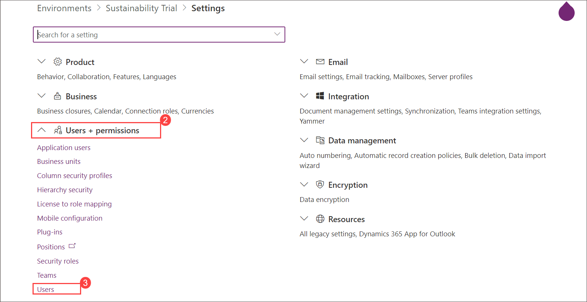

1. Click on **+ Add Users** from the top-left menu bar. In the **Add user** window, search for and select **Alex Wilber**, then click **Add**.

    

1. Navigate to the Manage security roles blade and select both the **Basic User role** and the **Sustainability All - Reports - Full Access Role**. After selecting these roles, proceed to click on Save to confirm your selections.

    

    .png)

    >**Note**: Basic User: Provides fundamental access rights necessary for standard user functionality within the system/application.

    >**Note**: Sustainability All - Reports - Full Access Role: Grants comprehensive access to all sustainability reports and full administrative capabilities related to sustainability management within the system/application.
     
## Review

Completing the lab, you will have gained practical knowledge on configuring Microsoft Sustainability Manager, including setting up organizational hierarchies, reference data, and unit conversion factors. Additionally, you will understand how to create reporting periods and assign user roles and permissions, essential for accurate carbon emission tracking and reporting.

## You have successfully completed the lab. Click on Next >>.
