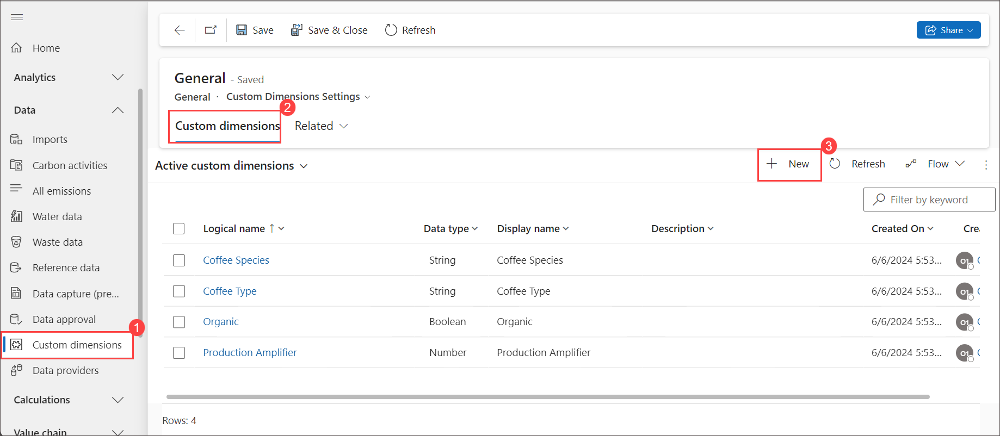
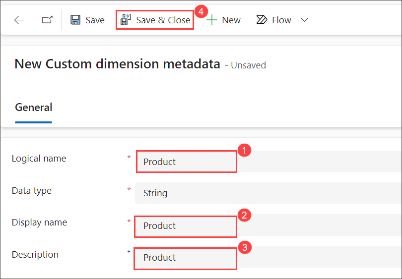
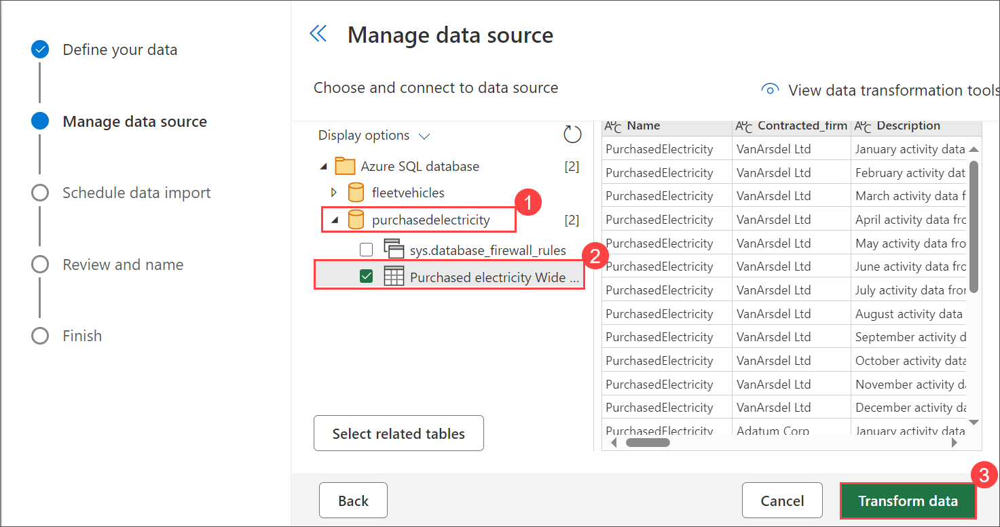
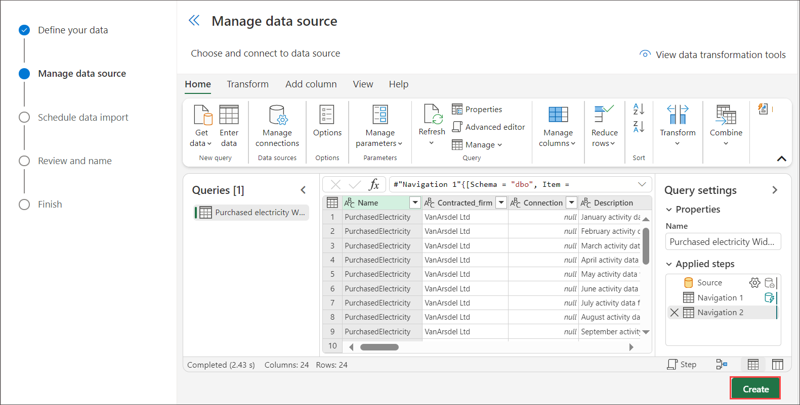
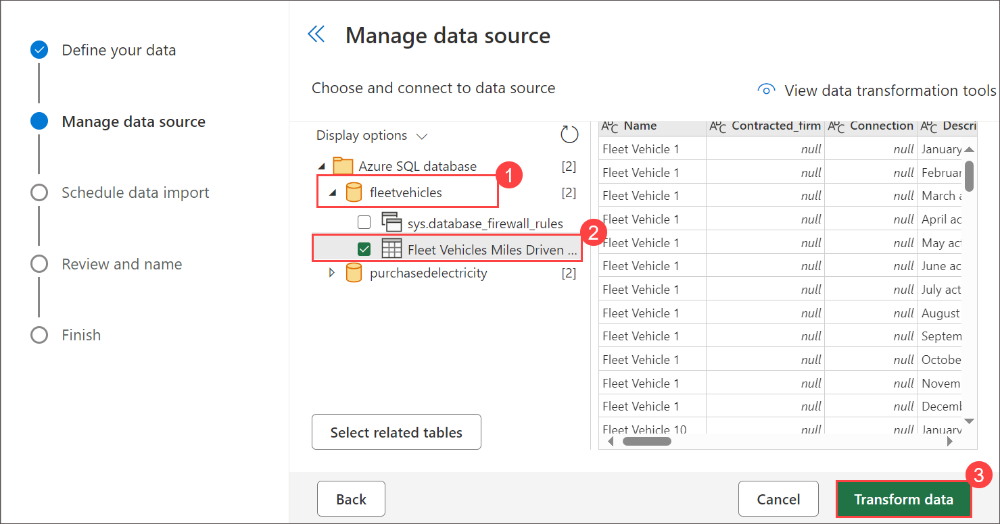
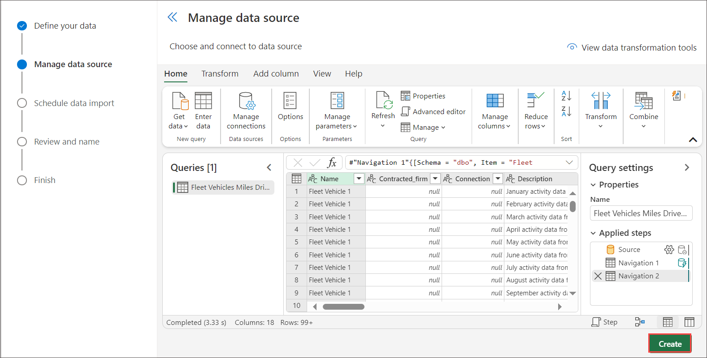
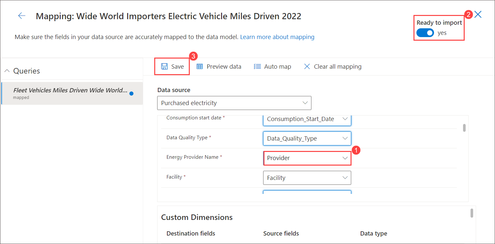
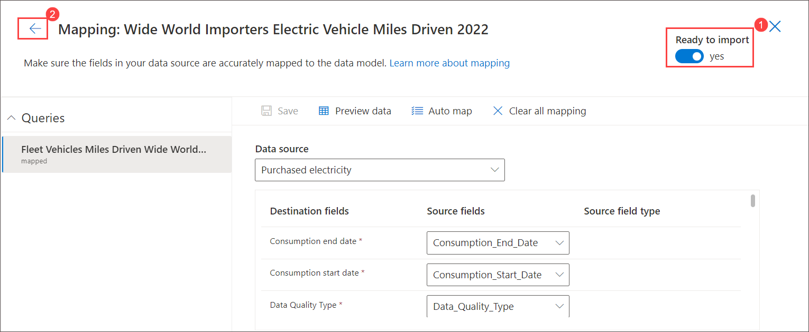

# Lab 3.1: Import Sustainability Data 

## Lab Overview

The **Data Ingestion** aspect of the Solution Focus Area. It follows the **Organization and Reference data Set up** and forms the basis for the emission calculations and the reporting thereafter. The Microsoft Sustainability Manager is flexible with multiple automated options to ingest data – such as the connectors as well as manual inputs.

## Lab Scenario

In this lab, for Wide World Importers utilizes the activity data Excel spreadsheets will be sourced – Emissions Analyst. The Activity data spreadsheets contain Electricity Purchased for the year 2023 and Miles driven by the fleet of Fabrikam Electric Trucks for the calendar year 2023. You observes that associated information such as product, model and Vehicle size needs to be added as custom dimension meta data before importing which are required to run the emission calculation and gather the Emission insights reports for monitoring. After adding this information, you can use Microsoft Sustainability Manger’s connector functionality to import from the Excel spreadsheets, and reviews other connectors available for future purposes. We uses the built-in Power Query functionality to transform the data to match Microsoft Sustainability Manager’s data schema and looks for other potential issues such as case-sensitive d data fields.

### Lab Objectives

In this lab, you will complete the following tasks:

- Task 1: Add custom dimension metadata
- Task 2: Import 2023 data for “Purchased Electricity“ for Facilities
- Task 3: Import 2023 Miles Driven data for electric trucks

## Estimated timing: 60 minutes

### Task 1: Add custom dimension metadata

In this task, we will enrich the Excel spreadsheet Purchased electricity Wide World Importers 2023.xlsx by adding custom dimensions metadata for mapping before importing the data.

1. Back in the Sustainability Manager portal, from the left navigation pane select **Custom dimensions (1)** and navigate to the **Custom dimensions (2)** tab under **Data**, then click **+ New (3)** at the top right of the **Active Custom dimensions** page.

   
 
1. Please enter the following details to create custom dimension metadata :

    - **Logical name** - **Product (1)**
   
    - **Display name** – **Product (2)**

    - **Description** - **Product (This is optional) (3)**
  	
    - Click **Save & Close (4)**.

   
 
1. Repeat the previous steps to create two custom dimension metadata as follows.

      -	**Logical name** - **Model (1)**
      
      -	**Display name** - **Model (2)**

      -   Click **Save & Close (3)**

           
     
      -	**Logical name** - **Vehicle Size** 
      
      -	**Display name** – **Vehicle Size**
      
      - Click **Save & Close (3)**

        

### Task 2: Import 2023 data for “Purchased Electricity“ for Facilities

In this task, we will import the Excel spreadsheet named Purchased electricity Wide World Importers 2023.xlsx. This spreadsheet contains data on the electricity purchased by Wide World Importers' facilities for the year 2023, which will be integrated into the Purchased electricity activity data.

1. Navigate to **Data** in the left navigation pane, select **Imports (1)**, go to the **Data import (2)** tab, and click **New (3)**.

   

1. On the **Imports** page, select **POWER QUERY GUIDED EXPERIENCE**.

   

1. On the **Define Your Data** page, under **Scope 2: Indirect emissions**, click **Add** for **purchased electricity (1)**, then click **Next (2)**.

    
 
1. On **Choose data source** window click on **View more**.

    

1. On the **New source** window select **Azure SQL database**.

    

1. On the **Connect to data source** under **Connection settings** provide following details.

  - **Server** :  <inject key="SqlserverURL"></inject> **(1)**

   - **Authentication Kind** : Basic **(2)**

   - **Username** : SQLUSER **(3)**

   - **Password** : **Password.1!!** **(4)**

   - Select the checkbox next to **Use encrypted connection (5)**

           

1. On the **Choose data** window expand **purchasedelectricity** and select **Purchase electricity wide world importer 2023** then click on **Transform data**.

    
   
1. You can complete various data and column transformations on the **Transform data** page of the Power Query wizard. As a result, you can adjust data types, update column mappings, and perform advanced transformations that you're familiar with in Microsoft Power Platform dataflows or Microsoft Power BI datasets. For this exercise, do not apply any transformations, click **Create**.

    
   
    >**Note** - Wait for the transformations to be applied properly, before you click **Create**, else you may get an error.
    
1. The **New data connection** wizard will now be on the **Schedule data** **import** page, where you'll complete the following actions:

     - Turn on the **Import data automatically** toggle to allow the option to set a schedule for the data to be imported automatically. Selecting this     
        option is beneficial if the connector will be used in a scenario where the data will change frequently, such as a web API or FTP server.

     - Turn on the **Replace previously imported data** toggle to remove all previously imported data and bring in the full dataset that was retrieved. 
         Selecting this option is beneficial if the data source isn't providing data from only the last import or if it always includes a full set of data. For 
         this scenario of importing historical data, leave both options turned off.

      - Select **Next** when finished.
        
          
 
1. On the Review and finish page, complete the following tasks:
    
    1. Enter a name for the new connection, such as **Wide World Importers Purchased Electricity 2023**.

    2. Select **Connect**.
 
1. Next, you'll need to map your source data to the data model. Data will not appear until this step is complete. Select on **Map fields**.

      
 
1. Select the **Data source** to map, in this exercise select **Purchased electricity** under **Carbon Activities.** Select **Auto Map** for the solution to automatically map the file’s source fields with the destination fields, for any field that is not an exact match the best match will be found and highlighted in blue, make sure to review them. Review the custom dimensions to ensure Model and Product are added as part of mapping. Remove the unnecessary custom dimensions if they are added When you are done with the mapping, toggle **Ready to Import** as yes and click on **Save**.

      
 
     >**Note**: In this scenario, we will need to map the columns from the spreadsheet to the columns in Microsoft Sustainability Manager. 

1. Now that we have reviewed our field mappings, toggle **Ready to Import** as yes. Click the back arrow. Click on **Done**.

     .png)

1. Click on **Done**.

   
   
1. You will be navigated back to **Data imports** where you can view the import you created.

1. The **Data Import** job will run, and the status will display **Scheduled** and then in a moment it switches to **Processing**. You might need to refresh your page to view the change.

1. After a minute or two select **Refresh** above the list to view the updated status, which should be **Complete**.
 
    
 
1. Go to **Carbon Activities** on the left navigation pane under **Data management**. Select **Purchased electricity** in the **Scope 2: Indirect emissions** section.

      
 
1. The Purchased electricity view shows all purchased electricity activity data that has been imported.
 
1. Filter the view by selecting the **Organizational Unit** dropdown menu and then selecting **Edit Filter**.

    
    
1. Select Organization unit > **Wide World Importers** from the **Edit filters: Purchased energy** dialog.

    
    
1. Select **Apply** to apply the filter to the column.
 
1. After a few moments, the view will refresh and the activity data records that were imported during this exercise will be displayed.

    

### Task 3: Import 2023 Miles Driven data for electric trucks

In this task, we will imports the Excel spreadsheet provided by Alex, _Purchased electricity Wide World Importers 2022.xlsx_. This brings in the Electricity Purchased by Wide World Importers facilities for the year 2022 into the Purchased electricity activity data.

1.  In the left navigation pane, under **Data**, select **Imports** and select **New**.

     

1. On the **Imports**, select **POWER QUERY GUIDED EXPERIENCE**.

   

1. Under **Carbon activities**, Select **Add**, next to **Purchased electricity** under Category name then click on **Next**.

    
 
1. On **Choose data source** window click on **View more**.

    

1. On the **New source** window select **Azure SQL database**.

    

1. On the **Connect to data source** under **Connection settings** provide following details.

   - **Server** :  <inject key="SqlserverURL"></inject> **(1)**

   - **Authentication Kind** : Basic **(2)**

   - **Username** : SQLUSER **(3)**

   - **Password** : **Password.1!!** **(4)**

   - Select the checkbox next to **Use encrypted connection (5)**

      
     

1. On the **Choose data** window expand **fleetvehicles** and select **Fleet vechicles Miles Driven Wide World Importers 2023** then click on **Transform data**.

      
   
1. You can complete various data and column transformations on the **Transform data** page of the Power Query wizard. As a result, you can adjust data types, update column mappings, and perform advanced transformations that you're familiar with in Microsoft Power Platform dataflows or Microsoft Power BI datasets. For this exercise, do not apply any transformations, click **Create**.

      
   
    >**Note** - Wait for the transformations to be applied properly, before you click **Create**, else you may get an error.
    
1. The **New data connection** wizard will now be on the **Schedule data** **import** page, where you'll complete the following actions:

     - Turn on the **Import data automatically** toggle to allow the option to set a schedule for the data to be imported automatically. Selecting this     
        option is beneficial if the connector will be used in a scenario where the data will change frequently, such as a web API or FTP server.

     - Turn on the **Replace previously imported data** toggle to remove all previously imported data and bring in the full dataset that was retrieved. 
         Selecting this option is beneficial if the data source isn't providing data from only the last import or if it always includes a full set of data. For 
         this scenario of importing historical data, leave both options turned off.

      - Select **Next** when finished.

          

1. On the Review and finish page, complete the following tasks:
    
    1. Enter a name for the new connection, such as **Wide World Importers Electric Vehicle Miles Driven 2023**.

    2. Select **Connect**.

1. Next, you'll need to map your source data to the data model. Data will not appear until this step is complete. Select on **Map fields**.

    
   
1. Select the **Data source** to map, in this exercise select **Purchased electricity** under **Carbon Activities.** Select **Auto Map** for the solution to automatically map the file’s source fields with the destination fields, for any field that is not an exact match the best match will be found and highlighted in blue, make sure to select **Energy Provider Name** to **Provider** from the drop down and review them. Review the custom dimensions (you may need to scroll down) ensure to remove the **Product > Provider** custom fields and then Toggle **Ready to Import** as yes and click on **Save**.
           
   

   >**Note**: In this scenario, we will need to map the columns from the spreadsheet to the columns in Microsoft Sustainability Manager. 

1. Now that we have reviewed our field mappings, toggle **Ready to Import** as yes. Click the back arrow.

    

1. Click on **Done**.
   
    
   
1. You will be navigated back to **Data imports** where you can view the import you created.

1. The **Data Import** job will run, and the status will display **Scheduled** and then in a moment it switches to **Processing**. You might need to refresh your page to view the change.

1. After a minute or two select **Refresh** above the list to view the updated status, which should be **Complete**.

   

1. Go to **Carbon Activities** on the left navigation pane under **Data management**. Select **Purchased electricity** in the **Scope 2: Indirect emissions** section.

      
 
1. The Purchased electricity view shows all purchased electricity activity data that has been imported.
 
1. Filter the view by selecting the **Organizational Unit** dropdown menu and then selecting **Edit Filter**.

    
    
1. Select Organization unit > **Wide World Importers** from the **Edit filters: Purchased energy** dialog.

    
    
1. Select **Apply** to apply the filter to the column.
 
1. After a few moments, the view will refresh and the activity data records that were imported during this exercise will be displayed.

    

You've now completed the data import of 2022 Purchased Electricity for Wide World Importers and Fleet vechicles Miles Driven Wide World Importers 2022. This step is imperative in realizing the goal of recording, reporting, and reducing carbon emissions.

## Review 
Completion of these tasks ensures accurate data integration, robust reporting capabilities, and enhanced environmental stewardship for Wide World Importers in Microsoft Sustainability Manager.

## You have successfully completed this lab. Proceed with the next lab.
