# Lab 3: Import Sustainability Data 

### Learning Objectives

In this lab, you will do the following:

-   Use Microsoft Sustainability Manager connectors to ingest data
-   Use Power Query to transform the data before ingestion
-   Review the ingested data in the “Purchase Electricity Activity Data” Dataverse Table
-   The newly ingested activity data during this lab exercise will be utilized in the remaining scenarios (calculations and reporting) in the upcoming lab exercises.

### Solution Focus Area

In this lab, the focus is on the “Data Ingestion” aspect of the Solution Focus Area. It follows the “Organization and Reference data Set up” and forms the basis for the emission calculations and the reporting thereafter. The Microsoft Sustainability Manager is flexible with multiple automated options to ingest data – such as the connectors as well as manual inputs. For scenarios that may require complex data transformation and/or ETL, tools like Azure Data Factory are recommended. You can explore this functionality in deeper detail on Microsoft Docs at **Overview of Microsoft Cloud for Sustainability Data Import**, https://docs.microsoft.com/en-us/industry/sustainability/import-data.

### Scenario

In this lab, Reed Flores – IT Admin for Wide World Importers utilizes the activity data Excel spreadsheets sourced by Alex Serra – Emissions Analyst. The Activity data spreadsheets contain Electricity Purchased for the year 2022 and Miles driven by the fleet of Fabrikam Electric Trucks for the calendar year 2022. Reed observes that associated information such as product, model and Vehicle size needs to be added as custom dimension meta data before importing which are required to run the emission calculation and gather the Emission insights reports for monitoring. After adding this information, Reed uses Microsoft Sustainability Manger’s connector functionality to import from the Excel spreadsheets, and reviews other connectors available for future purposes. Reed uses the built-in Power Query functionality to transform the data to match Microsoft Sustainability Manager’s data schema and looks for other potential issues such as case-sensitive d data fields.

# Exercise 1 : Import Sustainability Data 

### Learning Objectives

In this lab, you will do the following:

-   Use Microsoft Sustainability Manager connectors to ingest data
-   Use Power Query to transform the data before ingestion
-   Review the ingested data in the “Purchase Electricity Activity Data” Dataverse Table
-   The newly ingested activity data during this lab exercise will be utilized in the remaining scenarios (calculations and reporting) in the upcoming lab exercises.

### Solution Focus Area

In this lab, the focus is on the “Data Ingestion” aspect of the Solution Focus Area. It follows the “Organization and Reference data Set up” and forms the basis for the emission calculations and the reporting thereafter. The Microsoft Sustainability Manager is flexible with multiple automated options to ingest data – such as the connectors as well as manual inputs. For scenarios that may require complex data transformation and/or ETL, tools like Azure Data Factory are recommended. You can explore this functionality in deeper detail on Microsoft Docs at **Overview of Microsoft Cloud for Sustainability Data Import**, https://docs.microsoft.com/en-us/industry/sustainability/import-data.

### Scenario

In this lab, Reed Flores – IT Admin for Wide World Importers utilizes the activity data Excel spreadsheets sourced by Alex Serra – Emissions Analyst. The Activity data spreadsheets contain Electricity Purchased for the year 2022 and Miles driven by the fleet of Fabrikam Electric Trucks for the calendar year 2022. Reed observes that associated information such as product, model and Vehicle size needs to be added as custom dimension meta data before importing which are required to run the emission calculation and gather the Emission insights reports for monitoring. After adding this information, Reed uses Microsoft Sustainability Manger’s connector functionality to import from the Excel spreadsheets, and reviews other connectors available for future purposes. Reed uses the built-in Power Query functionality to transform the data to match Microsoft Sustainability Manager’s data schema and looks for other potential issues such as case-sensitive d data fields.

## Task 1: Import Data

In this exercise, you will learn about the steps that Reed takes to ingest the spreadsheets given by Alex. Data import is a vital task to bringing large volumes of data into Microsoft Sustainability Manager. Excel is utilized in this lab; however, many pre-built connectors are available, and Partners can build custom connectors to integrate with additional data sources. You can explore this functionality in deeper detail on Microsoft Docs, please visit **Overview of data connectors** at https://docs.microsoft.com/en-us/industry/sustainability/import-data-connectors.

**Important** Please ensure you have completed the previous lab to create Reference Data. **The data import process requires all Reference Data to exist, and the process is case sensitive, so please ensure the Reference data that was added has the exact same case formatting as what is found in the lab**. Failure to do so will result in errors during the data import process

### Task 1: Add custom dimension metadata

In this task, We will add additional information to the Excel spreadsheet that Alex provided: **Purchased electricity Wide World Importers 2022.xlsx**. Reed will add custom dimensions metadata for the mapping before importing the data from the Excel spreadsheet. 

1.	Select the **Custom dimensions** tab under **Data** then select **+ New** on the top right on the Active Custom dimensions page.

    
 
1.	Enter the details as follows: 

  	 - Logical name - Product
   
    - Display name – Product

    - Description - Product (This is optional)
  	
    - Click **Save & Close**.

      
 
1.	Repeat the previous steps to create another custom dimension metadata as follows 

      -	Logical name - Model
      
      -	Display name - Model
      
      -	Logical name - Vehicle Size  
      
      -	Display name – Vehicle Size

        

        

### Task 3: Import 2022 data for “Purchased Electricity“ for Facilities

In this task, We will imports the Excel spreadsheet provided by Alex, _Purchased electricity Wide World Importers 2022.xlsx_. This brings in the Electricity Purchased by Wide World Importers facilities for the year 2022 into the Purchased electricity activity data.

1.  In the left navigation pane, under **Data**, select **Imports** and select **New**

     

1. On the **Imports**, select **POWER QUERY GUIDED EXPERIENCE**.

   

1. Under **Carbon activities**, Select **Add**, next to **Purchased electricity** under Category name then click on **Next**.

    
 
1. On **Choose data source** window click on **View more**.

    

1. On the **New source** window select **Azure SQL database**.

    

1. On the **Connect to data source** under **Connection settings** provide following details

   - **Server** : 

   - **Authentication Kind** : Basic

   - **Username** : SQLUSER

   - **Password** : 

   - Select the checkbox next to **Use encrypted connection**

      
     

1. On the **Choose data** window expand **sustainability** and select **Purchase electricity wide world importer 2022** then click on **Transform data**.

    

1. You can complete various data and column transformations on the **Transform data** page of the Power Query wizard. As a result, you can adjust data types, update column mappings, and perform advanced transformations that you're familiar with in Microsoft Power Platform dataflows or Microsoft Power BI datasets. For this exercise, do not apply any transformations, click **Create**.

    
   
    >**Note** - Wait for the transformations to be applied properly, before you click **Create**, else you may get an error.
    
1. The **New data connection** wizard will now be on the **Schedule data** **import** page, where you'll complete the following actions:

     - Turn on the **Import data automatically** toggle to allow the option to set a schedule for the data to be imported automatically. Selecting this     
        option is beneficial if the connector will be used in a scenario where the data will change frequently, such as a web API or FTP server.

     - Turn on the **Replace previously imported data** toggle to remove all previously imported data and bring in the full dataset that was retrieved. 
         Selecting this option is beneficial if the data source isn't providing data from only the last import or if it always includes a full set of data. For 
         this scenario of importing historical data, leave both options turned off.

      - Select **Next** when finished.
        
          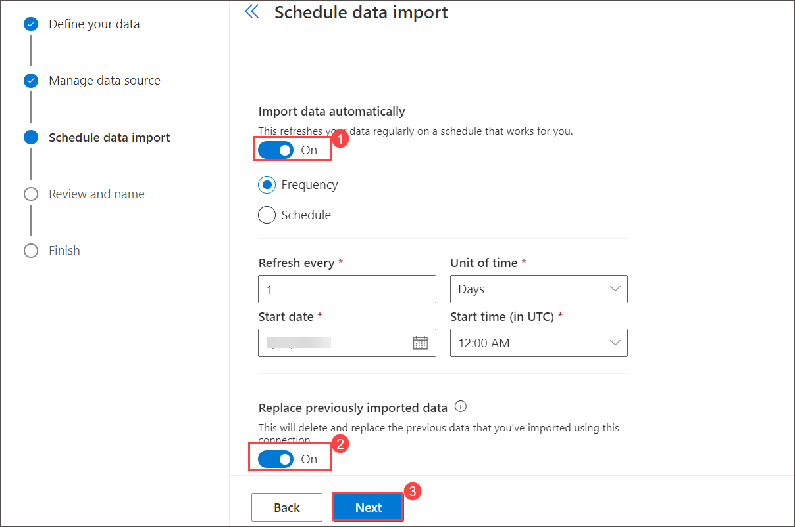
 
1. On the Review and finish page, complete the following tasks:
    
    1. Enter a name for the new connection, such as **Wide World Importers Purchased Electricity 2022**

    2. Select **Connect**.

    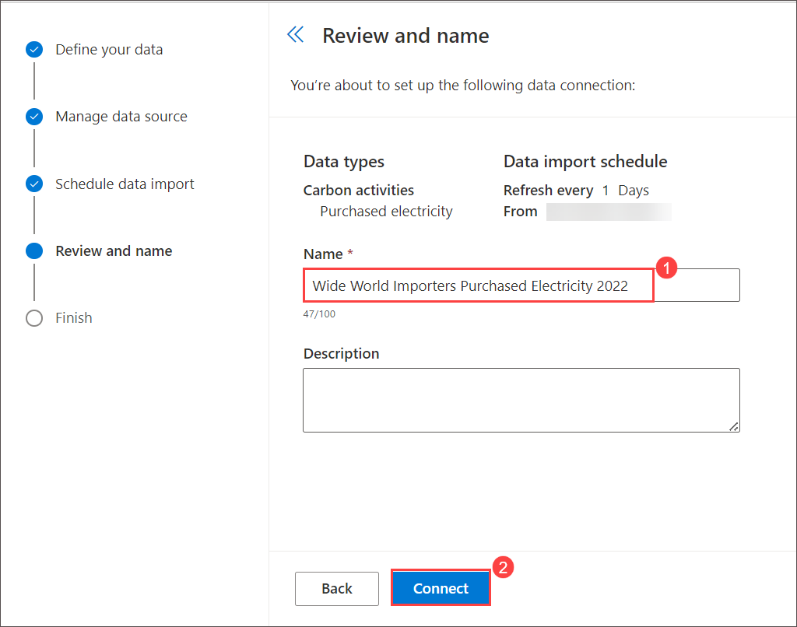
 
1. Next, you'll need to map your source data to the data model. Data will not appear until this step is complete. Select on **Map fields**.

      
 
1. Select the **Data source** to map, in this exercise select **Purchased electricity** under **Carbon Activities.** Select **Auto Map** for the solution to automatically map the file’s source fields with the destination fields, for any field that is not an exact match the best match will be found and highlighted in blue, make sure to review them. Review the custom dimensions to ensure Model and Product are added as part of mapping. Remove the unnecessary custom dimensions if they are added When you are done with the mapping, toggle **Ready to Import** as yes and click on **Save**.

      
 
     >**Note**: In this scenario, we will need to map the columns from the spreadsheet to the columns in Microsoft Sustainability Manager. 

1. Now that we have reviewed our field mappings, toggle **Ready to Import** as yes. Click the back arrow. Click on **Done**.

     

1. Click on **Done**.

   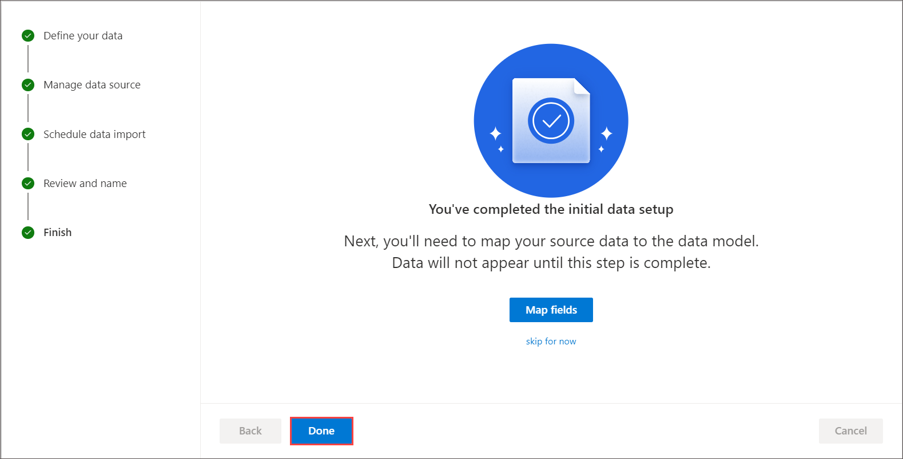
   
1. You will be navigated back to **Data imports** where you can view the import you created.

1. The **Data Import** job will run, and the status will display **Scheduled** and then in a moment it switches to **Processing**. You might need to refresh your page to view the change.

1. After a minute or two select **Refresh** above the list to view the updated status, which should be **Complete**.
 
    
 
1. Go to **Carbon Activities** on the left navigation pane under **Data management**. Select **Purchased electricity** in the **Scope 2: Indirect emissions** section.

      
 
1. The Purchased electricity view shows all purchased electricity activity data that has been imported.
 
1. Filter the view by selecting the **Organizational Unit** dropdown menu and then selecting **Edit Filter**.

    
    
1. Select Organization unit > **Wide World Importers** from the **Edit filters: Purchased energy** dialog.

    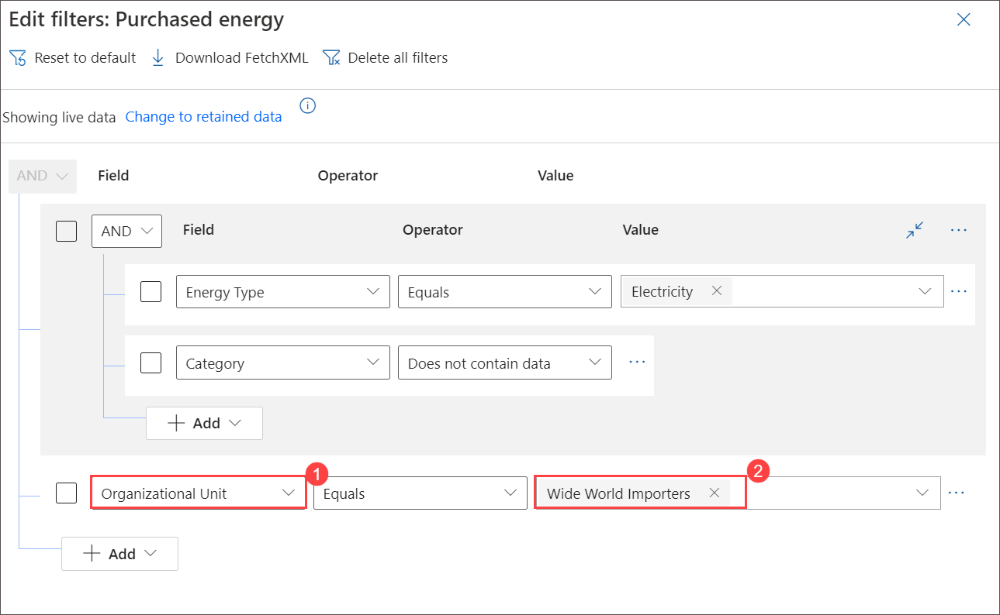
    
1. Select **Apply** to apply the filter to the column.
 
1. After a few moments, the view will refresh and the activity data records that were imported during this exercise will be displayed.

    

### Task 3: Import 2022 Miles Driven data for electric trucks

In this task, we will imports the Excel spreadsheet provided by Alex, _Purchased electricity Wide World Importers 2022.xlsx_. This brings in the Electricity Purchased by Wide World Importers facilities for the year 2022 into the Purchased electricity activity data.

1.  In the left navigation pane, under **Data**, select **Imports** and select **New**

     

1. On the **Imports**, select **POWER QUERY GUIDED EXPERIENCE**.

   

1. Under **Carbon activities**, Select **Add**, next to **Purchased electricity** under Category name then click on **Next**.

    
 
1. On **Choose data source** window click on **View more**.

    

1. On the **New source** window select **Azure SQL database**.

    

1. On the **Connect to data source** under **Connection settings** provide following details

   - **Server** : 

   - **Authentication Kind** : Basic

   - **Username** : SQLUSER

   - **Password** : 

   - Select the checkbox next to **Use encrypted connection**

      
     

1. On the **Choose data** window expand **Fleetvechicles** and select **Fleet vechicles Miles Driven Wide World Importers 2022** then click on **Transform data**.
  
1. You can complete various data and column transformations on the **Transform data** page of the Power Query wizard. As a result, you can adjust data types, update column mappings, and perform advanced transformations that you're familiar with in Microsoft Power Platform dataflows or Microsoft Power BI datasets. For this exercise, do not apply any transformations, click **Create**.

    >**Note** - Wait for the transformations to be applied properly, before you click **Create**, else you may get an error.
    
1. The **New data connection** wizard will now be on the **Schedule data** **import** page, where you'll complete the following actions:

     - Turn on the **Import data automatically** toggle to allow the option to set a schedule for the data to be imported automatically. Selecting this     
        option is beneficial if the connector will be used in a scenario where the data will change frequently, such as a web API or FTP server.

     - Turn on the **Replace previously imported data** toggle to remove all previously imported data and bring in the full dataset that was retrieved. 
         Selecting this option is beneficial if the data source isn't providing data from only the last import or if it always includes a full set of data. For 
         this scenario of importing historical data, leave both options turned off.

      - Select **Next** when finished.
 
1. On the Review and finish page, complete the following tasks:
    
    1. Enter a name for the new connection, such as **Wide World Importers Electric Vehicle Miles Driven 2022**

    2. Select **Connect**.

1. Next, you'll need to map your source data to the data model. Data will not appear until this step is complete. Select on **Map fields**.
 
1. Select the **Data source** to map, in this exercise select **Purchased electricity** under **Carbon Activities.** Select **Auto Map** for the solution to automatically map the file’s source fields with the destination fields, for any field that is not an exact match the best match will be found and highlighted in blue, make sure to review them. Review the custom dimensions to ensure Model and Product are added as part of mapping. Remove the unnecessary custom dimensions if they are added When you are done with the mapping, toggle **Ready to Import** as yes and click on **Save**.

 
     >**Note**: In this scenario, we will need to map the columns from the spreadsheet to the columns in Microsoft Sustainability Manager. 

1. Now that we have reviewed our field mappings, toggle **Ready to Import** as yes. Click the back arrow. Click on **Done**.

1. Click on **Done**.
 
1. You will be navigated back to **Data imports** where you can view the import you created.

1. The **Data Import** job will run, and the status will display **Scheduled** and then in a moment it switches to **Processing**. You might need to refresh your page to view the change.

1. After a minute or two select **Refresh** above the list to view the updated status, which should be **Complete**.
 
1. Go to **Carbon Activities** on the left navigation pane under **Data management**. Select **Purchased electricity** in the **Scope 2: Indirect emissions** section.

You've now completed the data import of 2022 Purchased Electricity for Wide World Importers and Fleet vechicles Miles Driven Wide World Importers 2022. This step is imperative in realizing the goal of recording, reporting, and reducing carbon emissions. Next, you'll import the 2022 Miles Driven for Wide World Importers fleet of electric vehicles.

## Exercise 2 : Emission Calculations

## Overview

### Background

In the previous two labs, we laid the foundation for emission calculations by setting up the organization, reference data such as Contractual instrument types and ingesting the Activity data. Now that the groundwork and data has been laid for emission calculations, this lab will focus on performing the emission calculations using a combination of factor libraries, emission factors, estimation factors and calculation profiles. Once the calculations are performed, we will review the emission calculations output.

### Learning Objectives

In this lab, you will do the following:

-   Review the Microsoft Sustainability Manager’s Dynamic calculation capabilities using Factor libraries, Emission factors and more.
-   Review the existing “EPA 2022 - eGRID” factor library and emission factors
-   Create a new custom factor library for estimating miles to kilowatt hours (kWh)
-   Create new calculation models and new calculation profiles for calculation jobs
-   The emissions calculated during this lab exercise will be utilized in the remaining scenarios (reporting and goals) in the upcoming lab exercises.

### Prerequisites

-   Microsoft Sustainability manager environment is set up with sample data
-   Lab 01 organization and reference data is entered
-   Lab 02 activity data is ingested

### Solution Focus Area

In the Emission calculations focus area calculation models are designed to calculate the emissions produced by the ingested activity data. The setup of the calculations breaks it down into two concepts: factor mappings and calculation models. Currently, Sustainability Manager has been verified with EPA default calculations and factor sets only. Additional factor sets will be available over time. Any factor set can easily be added or created by organizations based on their own business needs and regional requirements.

The following terminologies will be used throughout the configuration of Emission Calculations:

-   **Estimation Factor**: Provides a way to convert from one unit type to another, such as night stays to kilowatt hour (kWh) used.
-   **Emission Factor**: Defines the amount of greenhouse gas emitted by a given unit type, this includes defining gas emissions such as CO2, CH4, and N2O.
-   **Factor Mapping**: Provides a way to map reference data to a specific emission factor, simplifying calculation models by allowing customers to choose a reference data type and allowing the system to find the appropriate emission factor.
-   **Factor Library**: A collection/grouping of emission or estimation factors and factor mappings, used by calculation models.
-   **Calculation Model**: Thought of as the instruction set used by the application to perform the emission calculations, utilizes factor libraries, factor mappings, and emission/estimation factors to perform the emission calculations.
-   **Calculation Profile**: Provides the scheduling for calculation jobs, defining activity data filter and the calculation model (instruction set) to use.
-   **Allocation Profile**: An allocation profile configures methods to distribute emissions from a source (like a facility) to specific entities based on chosen parameters. It allows visualization of emissions distribution without altering default reporting, offering insights into how emissions are divided.
-   **Custom dimensions**: Custom dimensions can be used in emission calculation models, for example, in condition, calculation, and reporting actions.

   

### Personas and Scenarios

In this lab, Alex Serra – Emissions Analyst for Wide World Importers sets up factor mappings for Purchased electricity for facilities, mapping Contractual instrument types to the Florida electric grid (FRCC).

Alex also creates a new estimation factor library for estimating miles driven to kilowatt hours (kWh) for Fabrikam electric trucks. Alex then creates calculation models for calculating the carbon emissions produced per the facility’s purchased electricity. Post that, Alex creates a calculation model for estimated carbon emissions produced by the purchased electricity for charging Fabrikam Electric trucks (based on the kWh per mile driven estimate).

Finally, Alex creates and runs calculation profiles, filtering to Wide World Importers activity data. Post running the Calculation profile, Alex reviews the calculated emissions data before notifying Amber Rodriguez – Sustainability specialist that the emission calculations are complete.

In this lab exercise, we will focus on the scenarios illustrated below:

## Task  1: Set up Factor Libraries

In this exercise, you will learn about the steps that Alex takes to define the factor mappings for Purchased electricity, and an estimation factor library for estimating the amount of electricity purchased based on the Miles driven by Wide World Importers fleet of electric trucks. While electric vehicles do not have Scope 1, direct tailpipe emissions, they do have to be charged while transporting goods, in this case - across the USA. This charging of Electric trucks results in Scope 2 purchased electricity.

Wide World Importers may not know exactly how much electricity was purchased for charging the Electric Trucks, which grids the electricity came from, or what the energy source is. However, Wide World Importers can estimate the amount of electricity purchased by identifying how many kilowatt hours (kWh) are used per 100 miles, based on EPA vehicle efficiency data. You can explore this functionality in deeper detail on Microsoft Docs, please visit **Overview of Emission factors** at https://docs.microsoft.com/en-us/industry/sustainability/calculate-emission-factors.

**Important** Please make sure that you have completed the previous lab to create Activity Data. **The emissions calculations require all the Data Ingestion processes from the previous lab to be completed.** Failure to do so will result in errors or incorrect values during the calculations

## Task 2 : Add eGRID factor mappings
In this task, Alex will create factor mappings to map the contractual instrument types for Wide World Importers that Reed previously added to the respective electric grid emission factor. This process allows Microsoft Sustainability Manager to find the correct electric grid for a given contractual instrument type. This type can be expanded to map other reference data to specific emission factors, avoiding the need to create calculation models that are for specific emission factors.

1. In the left navigation pane, select **Calculations** > **Factor libraries**.

1. Select the EPA 2022 - eGRID factor library to open it.

     

1. Explore the EPA 2022 - eGRID factor library. The General tab includes the following identifying information about the factor library:

   - Name - Identifies the factor library in the list.
      
   - Description - Provides more information about the factor library.
      
   - Documentation reference - Identifies the documentation that's used to generate the factor library.
      
   - Type of factor library - Identifies if this factor library type is Custom, Demo (sample), or Standard (preloaded based on EPA libraries). For more information, see Emission 
       factors.
      
   - Library type - This functionally switches the library type between Emission or Estimation library. Emission libraries calculate emission gases. Estimation libraries create 
       estimated conversions from one unit type to another, such as night stays at a hotel to kWh used.   
     
      

1. Select the Emission factors tab to view a list of emission factors in the factor library.

1. The Emission factors list displays the name of the emission factor, the unit type, sub type, documentation reference, and gases generated. Because Wide World Importers is a Florida-based business and is connected to the FRCC electrical grid, select **FRCC (FRCC All)** from the list of emission factors.

    

    The FRCC (FRCC All) emission factor shows the carbon emissions that have been produced, 861 lb of CO2, 0.055 lb of CH4, and 0.007 lb of N2O, for each megawatt-hour (MWh) of energy consumed.

    This information is important to understand how the final CO2E (carbon dioxide equivalent) will be calculated later. When creating a new emission factor, you'll want to define how much of each gas is produced for a given unit. Several other gas types can be tracked, as shown on the screen, depending on the scenario. Some or all gas types might be used.

   

1. Click on back arrow which navigate to **EPA 2022 - eGRID** and select the **Factors mapping** tab.

   

1. Create factor mappings for the two contractual instrument types that were created in previous exercise and then associate them with the FRCC (FRCC All) emission factor. Each contractual instrument is a local power provider in Florida, and they're part of the FRCC electric grid. Select **+ New Factor mapping**.

    

1. Use the following information to populate the fields on the New Factor mapping screen and select the **Save & Close** button to save the record.

     - Name - FRCC - Purchased Electricity - VanArsdel Ltd
      
     - Reference data - VanArsdel Ltd

     - Factor library EPA 2022 - eGRID
      
     - Factor - FRCC (FRCC All)

      
      
1. Select **+ New Factor mapping**.

      

1. Use the following information to populate the fields on the New Factor mapping screen and select the **Save & Close** button to save the record.

      - Name - FRCC - Purchased Electricity - Adatum Corp

      - Factor library EPA 2022 - eGRID

      - Reference data - Adatum Corp
         
      - Factor - FRCC (FRCC All)

      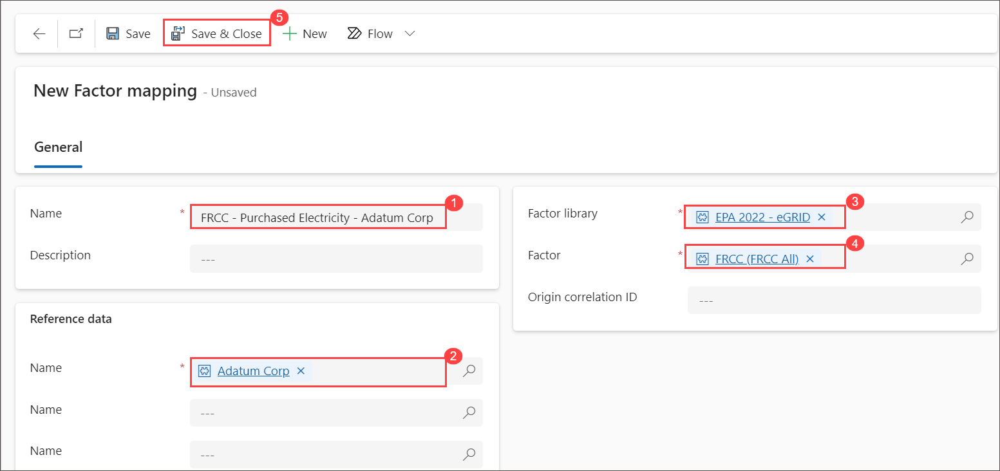

1. Now, you have two additional factor mappings, one for each contractual instrument that was added in previous step.

    

You've completed adding the factor mappings for your purchased electricity activity data. This step is important toward the creation of calculation models that will calculate emissions for multiple emission factors based on reference data, such as contractual instrument types or facilities.

By creating these factor mappings, you can choose contractual instrument types as emission factors during your calculation model creation. This information tells Microsoft Sustainability Manager to map the contractual instrument type on an activity data record to the emission factor that's listed in the factor mapping. Now, you can create more dynamic calculations rather than calculations that are specific to a given emission factor.

## Task 3: Create an estimation factor library

In this task, Alex will create an estimation factor library to define the estimation factor for estimating the kilowatt-hours (kWh) that are used for each mile driven. While electric vehicles don't have Scope 1, direct tailpipe emissions, they do need to be charged while transporting goods across the US, resulting in Scope 2 purchased electricity. Wide World Importers don't know the exact amount of electricity purchased, what grid the electricity came from, or the energy source; however, they can estimate the amount of purchased electricity by identifying the number of kilowatt-hours (kWh) that are used every 100 miles based on EPA vehicle efficiency.

1. Go to Factor libraries on the left navigation pane and select **+ New** to create a new library.

     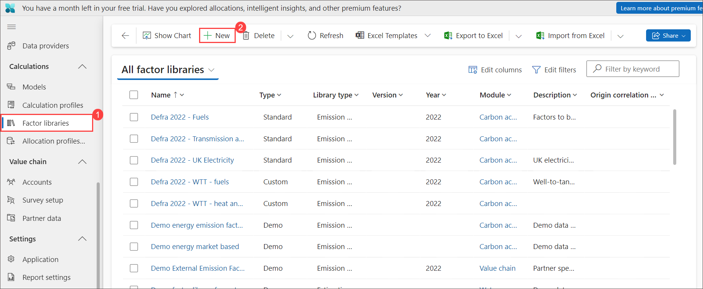

1. Use the following information to populate the fields on the New Factor library page and select **Save & Close** to save the record.

     - Name - Electric Vehicle Estimation Library
   
     - Description - Scope 2 Emissions from Electric Vehicles
   
     - Documentation reference - https://fueleconomy.gov/feg/byfuel/EV2022.shtml

     - Module - Select Carbon activities

     - Type - Custom
   
     - Library Type - Estimation factor library

     
   
1. The fields and their values are defined as follows (numbers corresponding to numerals in the ensuing screenshot):
   
    - The Name of the factor library identifies the factor library in the list.
   
    - The Description of the factor library provides more information about the factor library for others.
   
    - The Module is the data type that should appear in the Activity data.
   
    - The Documentation reference for the factor library identifies the documentation that's used to generate the factor library.
   
    - The Type of factor library identifies if it's a Custom, Demo (sample), or Standard (preloaded based on EPA libraries) type. For more information, see Emission factors.
   
    - The Library Type of the factor library switches the library type between Emission or Estimation library. Emission libraries calculate emission gases. Estimation libraries create estimated conversions from one unit type to another, such as 100 miles driven to kWh.
      
## Task 4: Create an estimation factor
In this task, Alex will create the estimation factor for estimating the kilowatt-hours (kWh) that are used for every mile driven. The EPA estimates electric vehicle efficiency in kilowatt-hours (kWh) for every 100 miles. Alex will use this same metric in the estimation factor to ensure that the estimation factor is consistent with the EPA.

1. Scroll down on the Factor library view and select Electric Vehicle Estimation Library (it will be near the bottom of your page) under Estimation factors.

    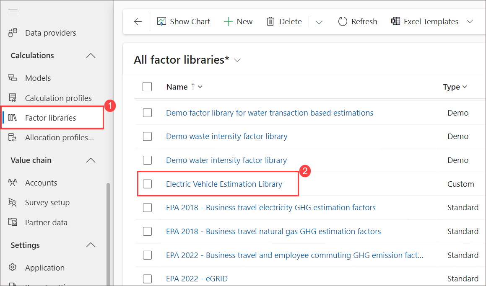

1. Select the Estimation Factors tab then click on  **+ New Estimation factor**.

    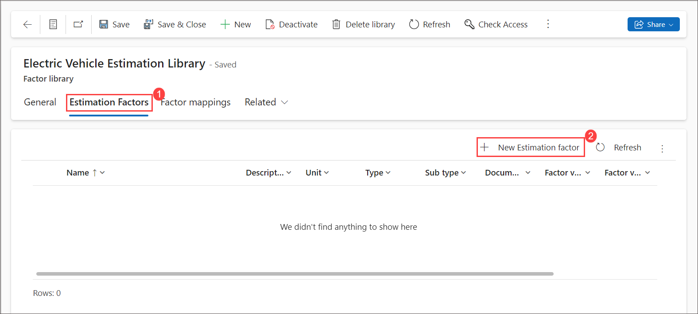

1. Review the Fabrikam Electric truck details on the EPA website and then enter the following information on the New Estimation factor screen and select Save & Close to save the record.

      Name - Fabrikam Electric Truck - EPA Estimate
      
      Documentation reference - https://fueleconomy.gov/feg/noframes/45318.shtml
      
      Factor Library - Electric Vehicle Estimation Library
      
      Unit - 100 Mile
      
      Factor value - 49.00
      
      Factor value unit - kWh

      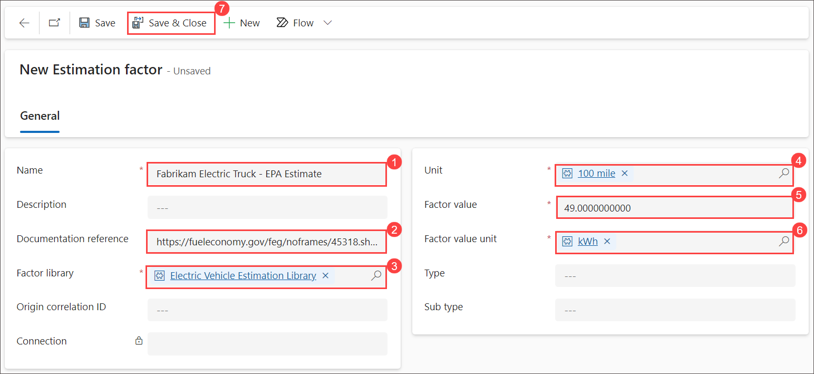

1. The fields and their values are defined as follows (numbers corresponding to numerals in the ensuing screenshot):

      - The Name identifies the emission factor in the list.
      
      - The Documentation reference identifies the documentation that's used to generate the estimation factor.
      
      - The Factor library links the estimation factor to the factor library. This value will default if you select New Estimation factor while you're in a factor library.
      
      - The Unit identifies what unit will be converted.
      
      - The Factor value determines the amount to be estimated according to the Factor value unit.
      
      - The Factor value unit specifies the unit type to be converted to.
      
1. The new emission factor is estimating that every 100 miles is equivalent to 49 kWh.

     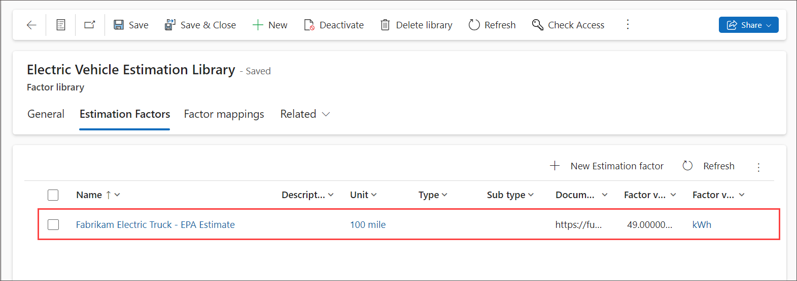

   >**Note**: You've now created an estimation factor. Estimation factors are important to be able to convert from one unit type to another when an estimate is appropriate, such as estimated fuel or battery economy of vehicles or when estimating gas and electric usage during hotel stays.

## Task 5: Set up calculation models
  
In this exercise, you learn about the steps that Alex takes to define calculation models that Microsoft Sustainability Manager uses to calculate emissions. Calculation models are the instruction sets, or recipes, that define the steps and values to use during the emission calculations. Microsoft Sustainability Manager provides several calculation models.

Take the opportunity to review some prebuilt models. They're excellent sources of information when you're creating new calculation models. You can also use calculation models as a template for new models. This exercise and the next discuss the algorithm that's used to calculate emissions. For more information, see Overview of Calculation models. 
 
 
## Task 6: Create a purchased electricity model
 
1. Select Calculations > Models on the left navigation pane. Select + New to create a new calculation model.

   

1. A new page opens, where you can set up the new calculation model. A Source action is added by default.

1. Populate the Source Details pane with the following data and select Save to save the record.

   Category name - Purchased Electricity: Contractual Instrument Based - 2022
   
   Module - Carbon Activities
   
   Activity data - Purchased electricity
   
   Calculation method - EPA Equation 1: Electricity (MWh) * EF
   
   Documentation reference - https://www.epa.gov/sites/default/files/2020-12/documents/electricityemissions.pdf

   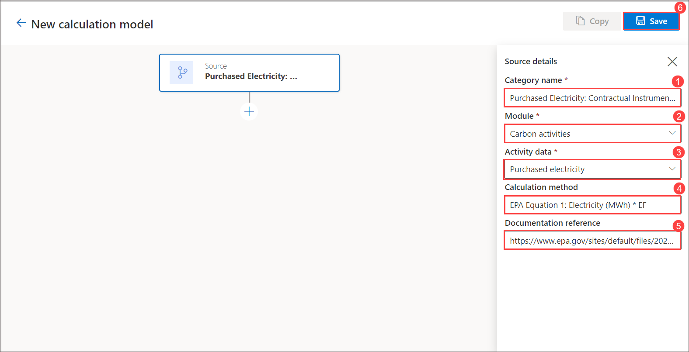

1. The fields and their values are defined as follows (numbers corresponding to numerals in the ensuing screenshot):

      - The Category name identifies the calculation model in the list.
      
      - The Module is used to identify which data types should appear in the Activity data field.
      
      - The Activity data identifies which type of activity data that the model processes.
      
      - Use the Calculation method to roughly estimate what the calculation does.
      
      - The Documentation reference identifies the documentation that's used to create the calculation model.
      

1. Select the plus (+) icon to add a new action to the calculation model.

    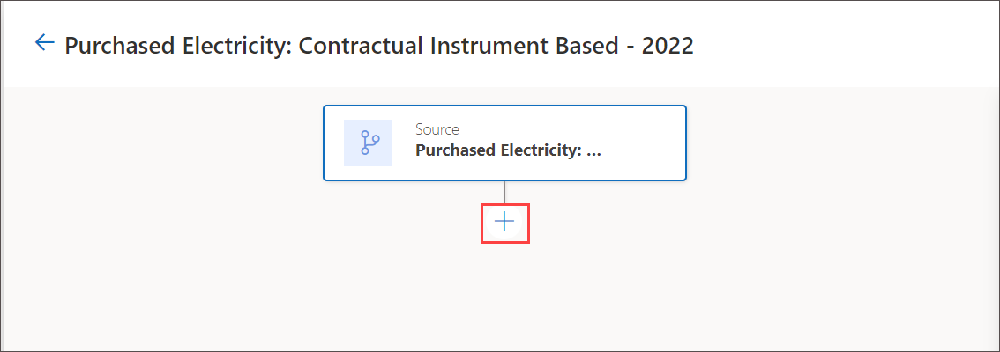

1. Select Report on the Available actions screen.   

   
 
1. A new Report action is added to the calculation model. Select that action to edit it.

   - You can use the Report action to calculate and report carbon emissions to the emissions table. This action uses the emission factor or factor mapping to identify the emission factor to be used based on the Emission factor dropdown list. In this exercise, the action uses a contractual instrument type field to identify the factor mapping and emission factor to use in the calculation.

   - After you've determined the emission factor for the activity data line, the activity data quantity and quantity unit will be converted to the same unit type as the emission factor. In this exercise, the kilowatt-hours (kWh) from the activity data are converted to megawatt-hours (MWh).

   - After the quantity has been converted, the converted value will be multiplied against each gas that's listed in the emission factor, determining the volume of gases produced.

   - To determine the CO2E (carbon dioxide equivalency), the gases produced are multiplied against their Global Warming Potential (GWP) factor, which is stored in the Greenhouse Gases Dataverse table and are added together.

   - The Report action stores the gases produced values, CO2E value, and other identifying information about the activity data row in the emissions table.

1. Populate the Report action with the following data and select Save to save the record.

      Category name - Electricity * EF (Contractual Instrument Type)
      
      Description - EPA Equation 1: Electricity (MWh) * EF
      
      Emission report value - Quantity
      
      Unit - Quantity unit
      
      Emission factor library - EPA 2022 - eGRID
      
      Emission factor - FRCC (FRCC All)

      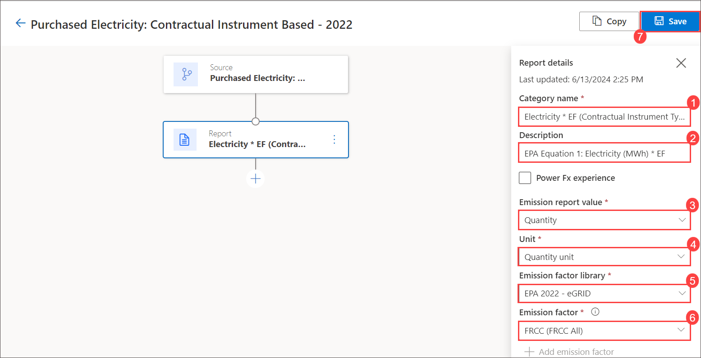

1. The fields and their values are defined as follows (numbers corresponding to numerals in the ensuing screenshot):

    - The Category name identifies the action in the calculation model.
      
    - Use the Description to roughly note what the calculation does.
      
    - The Emission report value identifies which field from the activity data type should be used to retrieve the value that's used in the emission calculation.
      
    - The Unit identifies the field from the activity data type to be used to retrieve the unit type of the value. Alternatively, you can specify a unit to always be used in the action, regardless of which unit is specified on the activity date type.
      
    - The Emission factor library identifies which factor library is used to identify the emission factor.
      
    - The Emission factor identifies which emission factor or factor mapping to use to calculate the emissions. Choosing a factor mapping allows multiple reference data values to map to an emission factor, allowing for a calculation model to not be bound to a single emission factor.
      

8. Select the back arrow on the record to return to the list of calculation models.

    The new calculation model should appear in the list. 
 
    Now, you've created a new calculation model. In this calculation model you've used factor mappings, an important differentiator for Microsoft Cloud for Sustainability. 
    Factor mappings allow the calculation models to be more dynamic by mapping reference data to emission factors, allowing you to have one model that can calculate multiple 
    emission factors. Calculation models are the instruction sets that Microsoft Cloud for Sustainability uses to calculate emissions. Several calculation models are included 
    with Microsoft Cloud for Sustainability based on EPA calculations. Occasionally, these included models might not match your unique customer needs, so you need to create new 
    models to provide custom calculations. Make sure that you review the included models to view other types of complex calculation models.

 ## Task 7: Create an electric vehicle miles driven model

In this task, Alex creates a new calculation model to calculate carbon emissions for miles driven by electric vehicles. This exercise uses the estimation factor library that was created in the previous exercise to estimate the kilowatt-hours (kWh) that are used by an electric vehicle and then calculate the carbon emissions for that electricity based on the US Average emission factor.

1. Select + New again to create another new calculation model. A new page opens, where you can set up the calculation model. A Source action is added by default.

2. Populate the Source Details pane with the following data:
      
      Category name - Electric Vehicle Miles Driven - 2022
      
      Module - Carbon Activities
      
      Activity data - Purchased electricity
      
      Calculation method - Miles Driven to kWh * EF
      
      Documentation reference - https://fueleconomy.gov/feg/byfuel/EV2022.shtml

  The fields and their values are defined as follows (numbers corresponding to numerals in the ensuing screenshot):

   The Category name identifies the calculation model in the list.
   
   The Module is used to identify which data types should appear in the Activity data field.
   
   The Activity data identifies which type of activity data that the model processes.
   
   Use the Calculation method to roughly note what the calculation is doing.
   
   The Documentation reference identifies the documentation that's used to create the calculation model.
   
   You can select Save to save the record.

   

 3. Select the plus (+) icon to add a new action to the calculation model.
 
     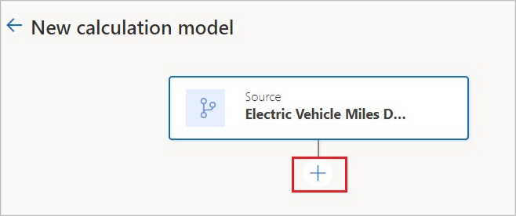

 4. Select Estimation factor on the list of Available actions.

    
 
 5. A new action is added to the calculation model. Select that action to edit it.

    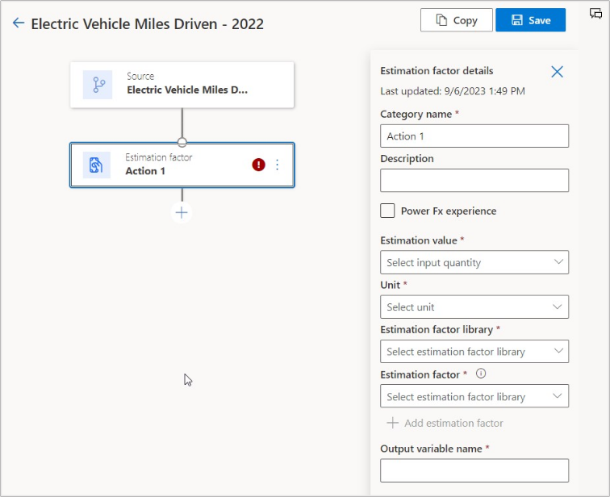

    You can use the Estimation factor action to create an estimated value for converting one unit type to another in a different unit group, such as converting night stays to 
    kilowatt-hours (kWh) used. This action is beneficial when it might be difficult to determine the exact amount of a given emission source that's used. In this exercise, the 
    action is used to convert miles driven by the fleet of electric vehicles to kWh used. This approach helps Wide World Importers estimate the carbon emissions for their fleet 
    of electric vehicles that are driving across the US and might be charging various amounts and on different grids and energy sources.

    The activity data quantity and quantity unit are converted to the same unit type as the estimation factor. In this exercise, the mile unit from the activity data is converted to 100-mile units.
   
    After the quantity has been converted, the converted value will be multiplied against the Factor quantity and stored in the output variable. The output variable is only accessible within the calculation model, available for use by actions further down the chain. The estimated value isn't stored in a table.

6. Populate the Estimation factor Details pane with the following data:

   Category name - Estimate kWh/100 Mile
   
   Estimation value - Quantity
   
   Unit - Quantity unit
   
   Estimation factor library - Electric Vehicle Estimation Library
   
   Estimation factor - Fabrikam Electric Truck - EPA Estimate
   
   Output variable name - kWhQuantity

 The fields and their values are defined as follows (numbers corresponding to numerals in the ensuing screenshot):

   The Category name identifies the action in the calculation model.
   
   The Estimation value identifies which field from the activity data type should be used to retrieve the value that's used in the estimation calculation.
    
  The Unit identifies the field from the activity data type that should be used to retrieve the unit type of the value. Alternatively, you can specify a unit to always be used 
  in the action, regardless of which unit is specified on the activity date type.

  The Estimation factor library identifies which factor library is used to identify the estimation factor.

  The Estimation factor identifies which estimation factor or factor mapping is used calculate the estimation. In this scenario, only one estimation factor has been created, so 
  it doesn't make sense to select a factor mapping currently.

  Use the Output variable name to name the output of the estimation factor calculation for use in actions further down the chain.

  You can select Save to save the record.

   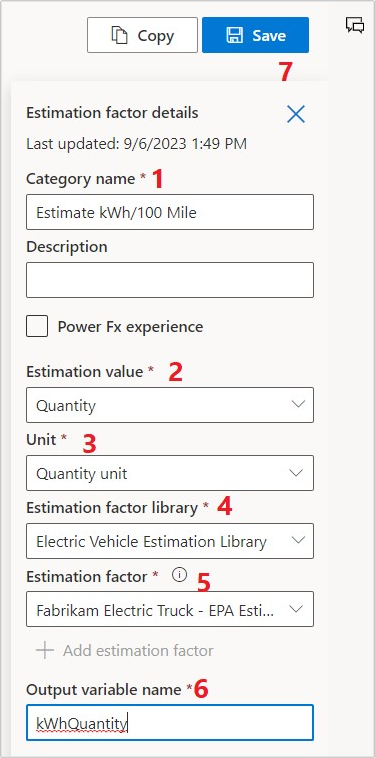

 7. Select the plus (+) icon to add a new action to the calculation model.

    

 
 8. Select Report on the Available actions list.

   

9. A new action is added to the calculation model. Select that action to edit it.

    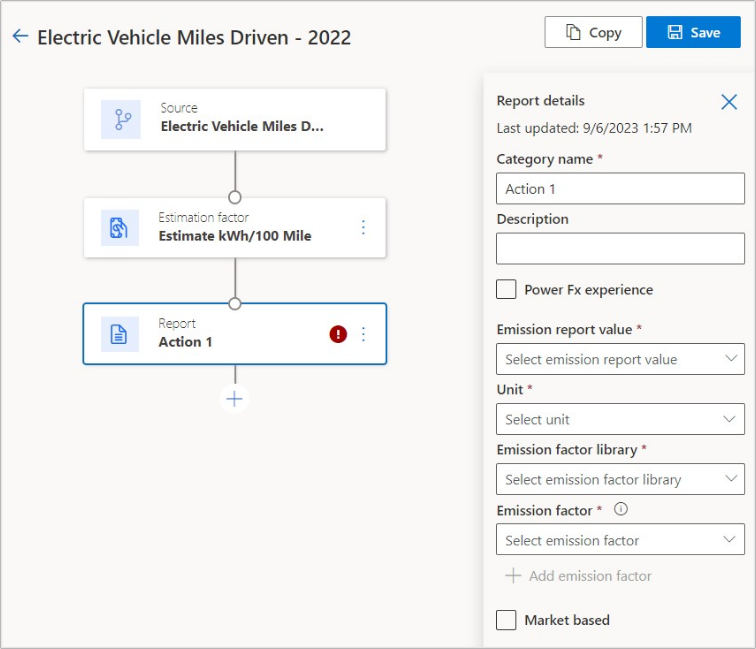

10. Populate the Report Details pane with the following data:

      Category name - kWh * EF
      
      Emission report value - kWhQuantity
      
      Unit - kWh
      
      Emission factor library - EPA 2022 - eGrid
      
      Emission factor - US Average

  The fields and their values are defined as follows (numbers corresponding to numerals in the ensuing screenshot):

     - The Category name identifies the action in the calculation model.
      
     - The Emission report value identifies which field should be used to retrieve the value that's used in the emission calculation. In this scenario, the Output variable from the Estimation factor action is used.

     - The Emission factor library identifies which factor library is used to identify the emission factor.

     - The Emission factor identifies which emission factor or factor mapping is used to calculate the emissions. In this scenario, Alex and Wide World Importers might not know which electric grid that a vehicle was charged on or the energy source, so Alex chooses the US Average emission factor to provide the estimated emissions.

     - You can select Save to save the record.

   

11. Select the back arrow on the record to return to the list of calculation models.

   The new calculation model should now appear in the list.

   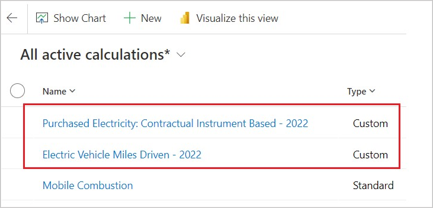

  You've now created a new calculation model. This calculation model includes an estimation factor, which allows you to calculate emissions in areas where you might not know 
  the exact quantity of an emission source but still need to account for the carbon emissions. Calculation models are the instruction sets that Microsoft Cloud for 
  Sustainability uses to calculate emissions. Several calculation models are included with Microsoft Cloud for Sustainability based on EPA calculations. Occasionally, these 
  included models might not match your unique customer needs, so you need to create new models to provide custom calculations. Make sure that you review the included models to 
  view other types of complex calculation models.

## Exercise - Run calculations

In this exercise, you learn about the steps that Alex takes to define and run calculation profiles. Microsoft Sustainability Manager uses calculation profiles to define the parameters and scheduling of calculation jobs. Calculation profiles allow an organization to define what activity data to calculate emissions for, the filters on that data, which calculation model to use, and if the calculation should be redone whenever the chosen activity data changes. Calculation profiles use the parameters to create calculation jobs. These calculation jobs are the background worker jobs that iterate over an organization's activity data. The calculations determine the carbon emissions based on the calculation model that's defined in the calculation profile. 

## Task 1 : Create a purchased electricity calculation profile
In this task, Alex creates a calculation profile for the electricity that Wide World Importers purchased for their facilities in 2022. Alex uses the calculation model that was previously defined in this exercise. Alex filters the profile to only activity data for the Wide World Importers organizational unit and where the unit type is kilowatt-hours (kWh). These filters ensure that only the purchased electricity for Wide World Importers is included in the calculation job. This task excludes the miles driven by the fleet of electric vehicles, which is covered in the next task.

1. Go to Calculation profiles on the left navigation pane. Select + New to create a new calculation profile

     

1. Populate the following information on the New calculation profile wizard.

      Calculation profile name - **Purchased Electricity: Contractual Instrument Based 2022 Wide World Importers**
      
      Module - Select **Carbon activities**
      
      Emissions source - **Purchased electricity**
      
      Activity data to include in calculation - Select **Add** > **Add row** and select **Organizational Unit** equals **Wide World Importers** then  select **Add** > **Add row** and **Quantity unit** equals **kWh**
      
      Calculation model - Select **Purchased Electricity: Contractual Instrument Based - 2022** from the dropdown list
      
      Schedule - Select the **Automatically run this calculation when data is refreshed** checkbox

      Select **Next**.

      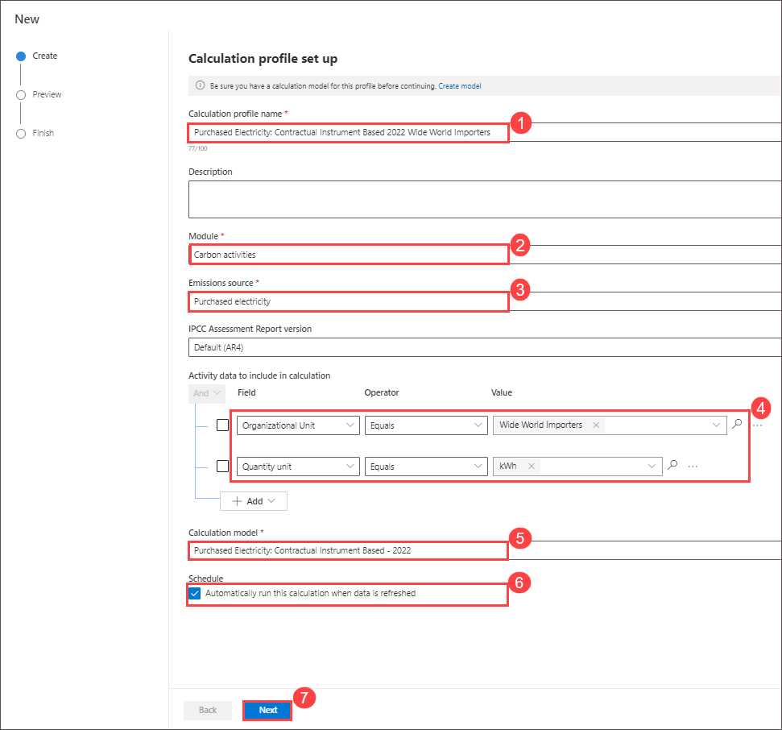

1. The fields and their values are defined as follows (numbers corresponding to numerals in the ensuing screenshot):
      
     - The Calculation profile identifies the calculation profile in the list.
      
     - The Module is used to identify which data types should appear in the Activity data field.
      
     - The Emissions source identifies which activity data type should be used in the calculation.
      
     - Use Activity data to include in calculation to filter activity data to a specific subset of the activity data type.
      
     - The Calculation model identifies which calculation model should be used for the calculation. Be sure to choose the calculation model from the dropdown list.
      
     - Use the Automatically run this calculation when data is refreshed filter to automatically trigger calculations when the matching activity data is refreshed.
      
1. On the Preview page of the New calculation profile wizard, the emissions are calculated for the first row of data that matches the Activity data to include filter. In this scenario, 
   the values that are shown in the preview might differ from the following image.

   These values were determined by converting the consumed kilowatt-hours (kWh) to megawatt-hours (MWh): 3519.038/1000 = 3.519038 MWh
   
   You determine the values of emissions gasses by multiplying the converted consumption by each greenhouse gas factor from the emission factor (FRCC) that's determined in the factor mapping:
   
   CO2: 3.519038 * 861 = 3,029.892 lb
   
   CH4: 3.519038 * .055 = 0.194 lb
   
   N20: 3.519038 * .007 = 0.025 lb
   
   Then, the greenhouse gases are multiplied by their Global Warming Potential (GWP) factor that's found in the Greenhouse gases table and then the values are added.
   
   CO2: 3,029.892 * 1 = 3,029.892 lb
   
   CH4: 0.194 * 25 = 4.85 lb
   
   N20: 0.025 * 298 = 7.45 lb
   
   CO2E: 3,029.892 + 4.85 + 7.45 = 3,042.19 lb

4. Select Save to save your calculation profile.

    

5. Select Done.
   

## Task: Create an electric vehicle miles driven calculation profile

In this task, Alex creates a calculation profile for the miles driven by Wide World Importers' fleet of electric vehicles for 2022. Alex uses the calculation model that was previously defined in this exercise. Additionally, Alex filters the profile to only activity data for the Wide World Importers organizational unit and where the unit type is mile. These filters ensure that only the miles driven for Wide World Importers' fleet of electric vehicles are included in the calculation job. This task excludes the purchased electricity, which was covered in the previous task.

1. Select + New Calculation profile to create a new calculation profile.

    Populate the following information on the New calculation profile wizard.

     - Calculation profile name - Electric Vehicle Miles Driven 2022

     - Module - Carbon activities

     - Emissions source - Purchased electricity

     - Activity data to include in calculation - Select add > add row and select Organizational Unit equals Wide World Importers and Quantity unit equals mile

     - Calculation model - Select Electric Vehicle Miles Driven - 2022 from the dropdown list

     - Schedule - Select the Automatically run this calculation when data is refreshed checkbox

2. The fields and their values are defined as follows (numbers corresponding to numerals in the ensuing screenshot):

      The Calculation profile name identifies the calculation profile in the list.
      
      The Module is used to identify which data types should appear in the Activity data field.
      
      The Emissions source identifies which activity data type should be used in the calculation.
      
      Use Activity data to include in calculation to filter activity data to a specific subset of the activity data type.
      
      The Calculation model identifies which calculation model should be used for the calculation. Be sure to choose the calculation model from the dropdown list.
      
      Use Automatically run this calculation when data is refreshed to automatically trigger calculations when the matching activity data is refreshed.
      
      The form should resemble the following image. Select Next.

3. The Preview page of the New calculation profile wizard shows the emissions that were calculated for the first row of data that matches your Activity data to include filter. In this scenario, the values that are shown in the preview might differ from the following image.

    These values were determined by converting the miles driven to kWh: (7484.724 / 100) * 49 = 3667.515 kWh
    
    The consumed kWh converted to MWh: 3667.515/1000 = 3.667515 MWh
    
    Multiply the converted consumption by each greenhouse gas factor from the emission factor (FRCC) that was determined in the factor mapping:
    
    CO2: 3.667515 * 861 = 3,001.127 lb
    
    CH4: 3.667515 * .055 = 0.238 lb
    
    N20: 3.667515 * .007 = 0.033 lb
    
    Multiply the greenhouse gases by their GWP factor that's found in the Greenhouse gases table and then add the values:
    
    CO2: 3,001.127 * 1 = 3,001.127 lb
    
    CH4: 0.238 * 25 = 5.95 lb
    
    N20: 0.033 * 298 = 9.834 lb
    
    CO2E: 3,001.127 + 5.95 + 9.834 = 3,016.911 lb

4. Select Save to save your calculation profile.

5. Select Done.

## Task: Run calculation profiles
 
In this task, Alex runs the newly created calculation profiles for the electricity that Wide World Importers purchased and for miles that Wide World Importers' fleet of electric vehicles drove. This task creates a calculation job that iterates over each activity data row that matches the calculation profile filter criteria. Additionally, it uses the calculation models that you created previously in this exercise to calculate the carbon emissions for each row. The results are placed in the emissions table, which Alex will review after the calculations are complete.

1. To run the calculation profile for Purchased Electricity: Contractual Instrument Type 2022, complete the following steps:

    - Select Purchased Electricity: Contractual Instrument Type 2022 in the list.

    - Select Run calculation on the command bar.

2. To run the calculation profile for Electric Vehicle Miles Driven 2022, follow these steps:

    - Select Electric Vehicle Miles Driven 2022 in the list.

    - Select Run calculation on the command bar.

3. After several minutes (approximately six minutes), both calculation jobs should be completed. Select the Refresh button on the command bar to check the status of the calculation jobs. The two calculation profiles should now have a Status of Succeeded.

4. In the lower-left corner, change the area to Analytics.

5. Go to All emissions on the left side of the page.

6. The All emissions view shows all emissions that have been calculated or directly imported.

7. Filter the view by selecting the down arrow next to the Organizational Unit column. Select Filter By. Select Wide World Importers. Select Apply.

8. After a few moments, the view refreshes. The calculated emissions data for each activity data record that was imported in previous exercises is shown. Scroll to the right to view the CO2E carbon emission values.

   
You've now created and run calculation profiles. Calculation profiles are the final step in calculating and recording your carbon emissions in Microsoft Cloud for Sustainability. Now, you'll be able to report and reduce your carbon emissions, which are discussed in the next exercises. It might take 30 minutes for your emissions to appear in the reporting areas.

## Exercise - Create allocation profiles and run calculations

In this exercise, you learn about the steps that Alex takes to create the allocation method, method details and an allocations profile. Allocations help visualize how your emissions are generated in multiple methods without impacting the default emissions reporting. With allocations, you can visualize how your emissions are distributed based on a parameter.

## Task: Create allocation methods

In this task, Alex creates an allocation method called Headcount to understand the emissions distributed based on the purchased electricity.

1. Select Data on the left navigation pane.

2. Select Reference data.

3. Select View for (Preview) Allocation methods.

4. Select New under Active Allocation methods.

5. Enter the Name as Headcount and select Save & Close. The allocation method is created.

## Task: Create the allocation method details

In this task, Alex creates the allocation method details by importing an excel file with the details. You must download the sample data - Allocation Method Details.zip for this task.

1. Select Reference data on the left navigation pane.

2. Select View for (Preview) Allocation method details.

3. Select New.

4. Select the three horizontal dots and select Import from Excel.

5. Select Choose File and then upload the allocation method details sample data.

6. Select the allocation method details sample data.

7. Select Next.

8. Select Finish Import.

9. Select Done. The data is imported successfully.

## Task: Create an allocation profile

1. Select Calculations from the left navigation pane.

2. Select Allocation profile(preview).

3. Select New.

4. Select Next.

5. Select the Profile method as Headcount that you created in the previous task and Profile period as Yearly.

6. Select Next.

7. Enter the Allocation profile name as Headcount and select Done.

8. Select Continue.

9. Select OK. The allocation profile is created successfully.

10. In the Active Allocation Profile page, select the profile and select Run allocation for the profile created.

11. Refresh the page and select the Allocation profile to view the status of the calculation.

You created the allocation methods and set up the allocation profile with this method. Now, you'll be able to visualize how your emissions are generated using these methods without impacting the default emissions reporting. 
