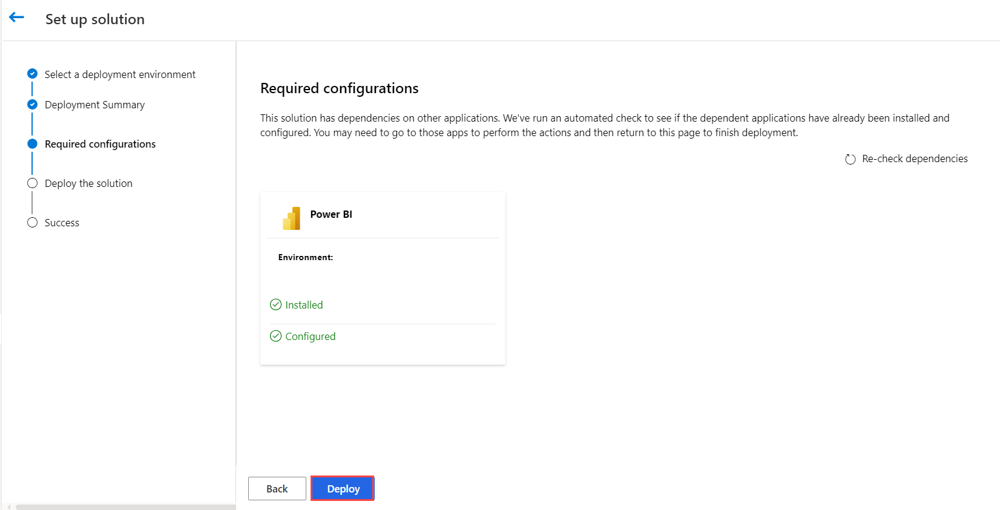
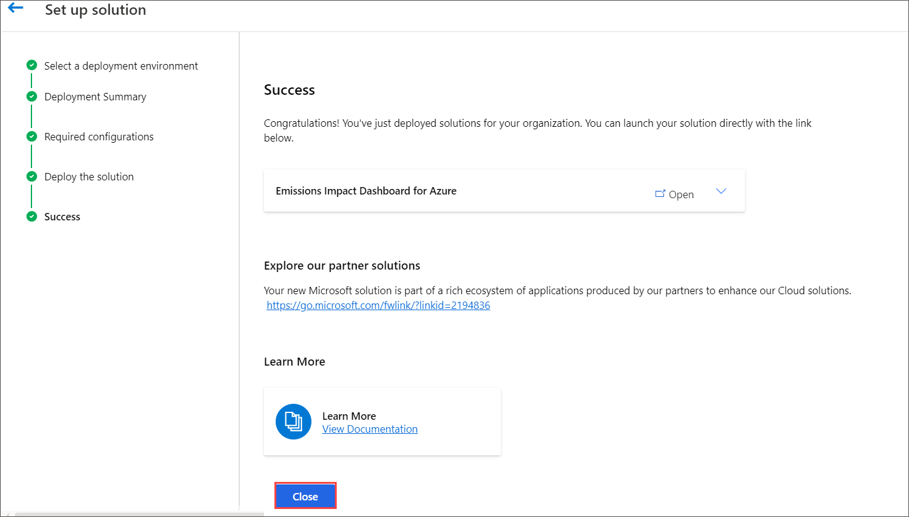
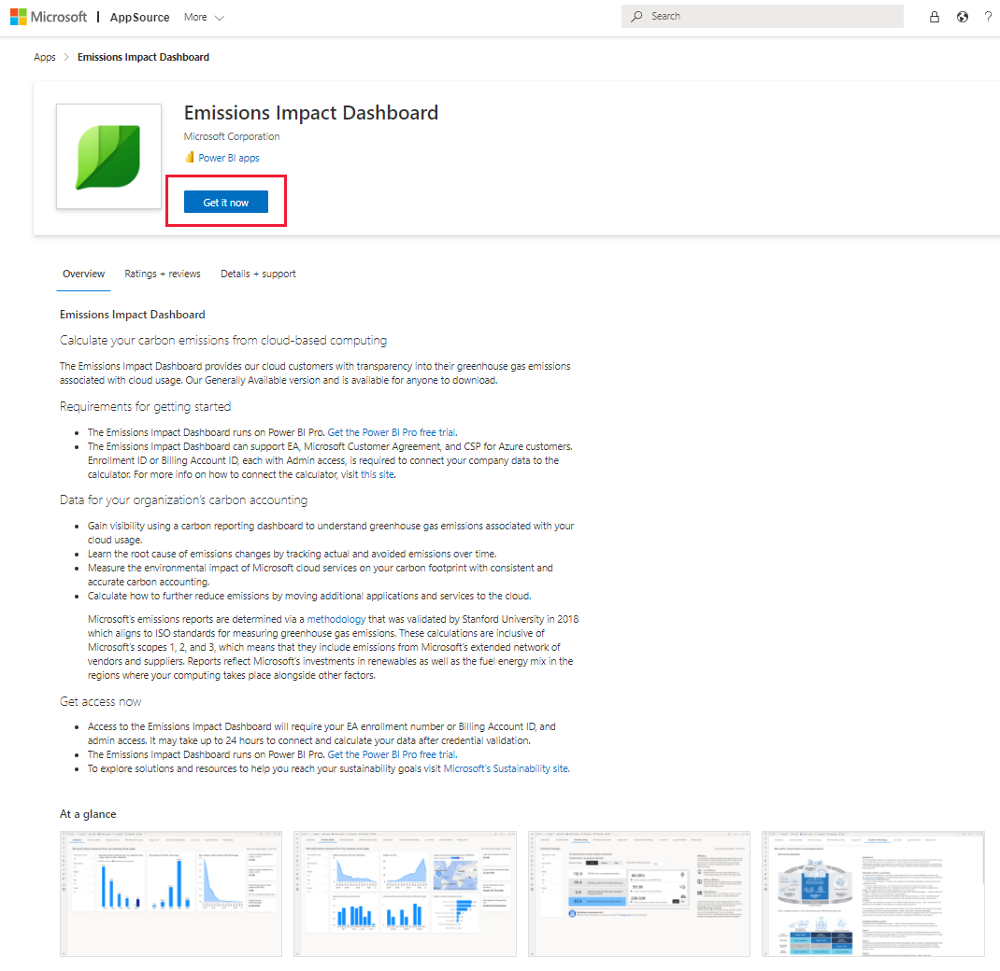
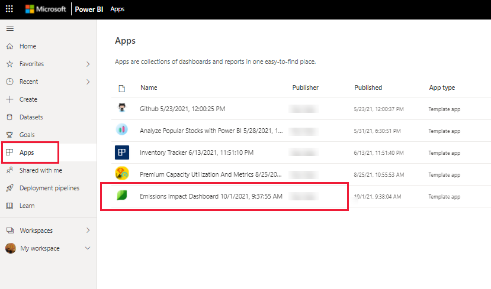
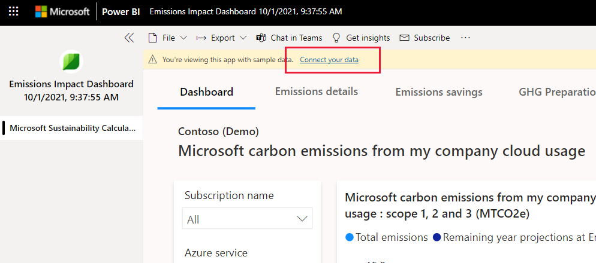
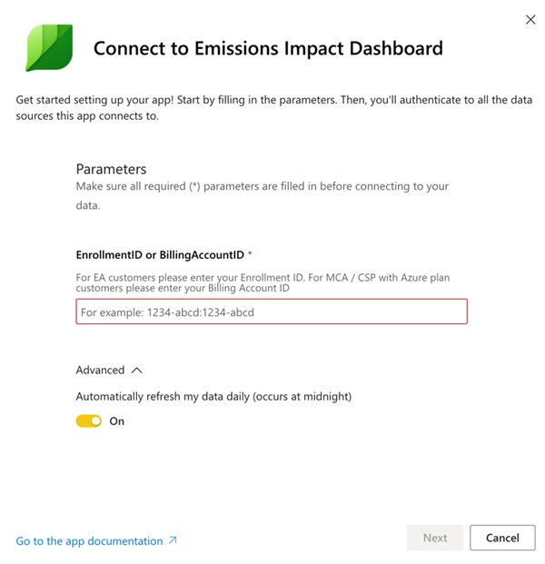
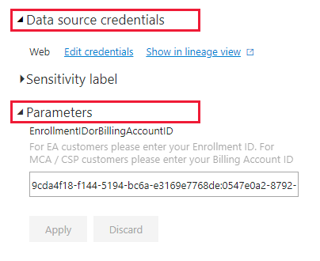
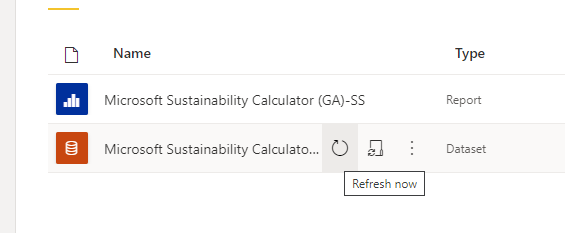
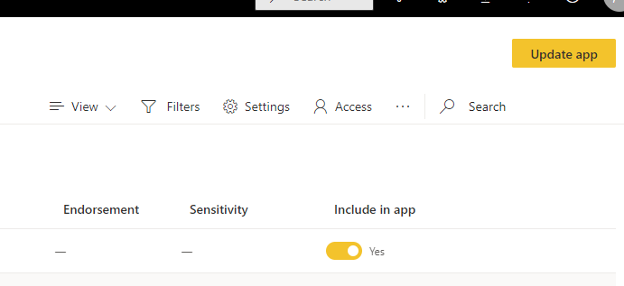

## Review an existing Azure deployment

Content not found

## Connect to MSM 
Content not found

## Review actions to optimize the carbon emissions.  
Content not found

## Exercise 1 : Emission Impact Dashboard for Azure 

The Emissions Impact Dashboard promotes transparency of information and provides insights that empower you to make effective decisions to reach your sustainability goals.

### Task 1 : Deploy the dashboards from the Solution Center

In this task, you sign in to the Microsoft Cloud Solution Center and deploy the Microsoft Cloud for Sustainability dashboard solutions.

1. Open a browser in InPrivate or Incognito mode and then go to https://solutions.microsoft.com.

2. Use the credentials with your Power BI Pro license install.

3. After sign-in is complete, on the Home page of Microsoft Cloud Solution Center, select View all solutions on the Microsoft Cloud for Sustainability tile.

   

4. From the available capabilities, select Report impact and progress.

5. From the available solutions list, select Emissions Impact Dashboard for Azure and Emissions Impact Dashboard for Microsoft 365 with the Added checkbox and then select Deploy.   

   

6. Provide the name for your deployment, select the terms of service and then select Next.

   

7. Verify that the pre-deployment dependencies are installed and set up. Select Deploy.

     

8. Wait for the deployment to show as successful. You're notified about the deployment start and success through email. Select Close.

   

9. Go to Microsoft [Power BI](https://app.powerbi.com/home?experience=power-bi), select the Apps on the left navigation pane. You see the Emissions Impact Dashboard for Microsoft 365 and select the Emissions Impact Dashboard for Azure listed on the Apps page.

    

10. You will be navigated to **Emissions Impact Dashboard for Azure**.
    
You successfully installed the Emissions Impact Dashboard for Azure and Emissions Impact Dashboard for Microsoft 365 applications.

## Install the app

2. Select the following link https://appsource.microsoft.com/en-us/marketplace/apps?search=emissions%20impact%20dashboard&page=1 to get to the app: Emissions Impact Dashboard template app.

3. On the AppSource page for the app, select GET IT NOW.

    

4. When prompted, select Install.

   

5. When the app finishes installing, it appears on your Power BI Apps page. Select the app and open it.

   

6. Select Connect your data.

   

8. In the Connect to Emissions Impact Dashboard dialog that appears, under EnrollmentIDorBillingAccountID, enter either your billing account ID (formerly known as the enrollment number) for EA Direct customers or billing account ID for MCA/MPA.

    
   When done, select Next.

10. Connect your account:

      For Authentication method, select OAuth2.
      For Privacy level setting for this data source, select Organizational.
      When done, select Sign in and connect.

   
   
9. Select the user account. Be sure to sign in with the credentials that have access to the enrollmentID/Billing AccountID with valid permissions as explained in the prerequisites.

10. Wait for the view to build, which can take up to 24 hours. Refresh the dataset after 24 hours.

## Update the app
Periodically you might receive update notifications from Appsource/Power BI about a new version of the app. When you install the new version, the following options are available:    

Select Update the workspace and the app, and then select Install. The update installs, overwriting the existing/installed workspace and app.

## Issues

If there are any issues with the dataset refresh/app update during the updating process, validate these steps and refresh the dataset.

Follow these steps to make sure your dataset configurations are set correctly:

1. Go to the workspace panel and open the app workspace.

2. Open the Scheduled Refresh option in the dataset settings and make sure the billing account ID is correct.

    

3. Open the Parameters section and configure the data source again in the Data Source section with the credentials that have access to the Enrollment ID / Billing Account ID with valid permissions, mentioned in the prerequisites.

   

4. After the above steps are validated, go back to the app workspace and select the Refresh option.

   

5. After the dataset refreshes successfully, select the Update App option at the top-right corner of the app workspace.

   

### Reference Link:

  https://learn.microsoft.com/en-us/power-bi/connect-data/service-connect-to-emissions-impact-dashboard?toc=%2Findustry%2Fsustainability%2Ftoc.json&bc=%2Findustry%2Fbreadcrumb%2Ftoc.json

## Review Emission Impact Dashboard for M365 

https://learn.microsoft.com/en-us/power-bi/connect-data/service-connect-emissions-impact-dashboard-microsoft-365?toc=%2Findustry%2Fsustainability%2Ftoc.json&bc=%2Findustry%2Fbreadcrumb%2Ftoc.json
