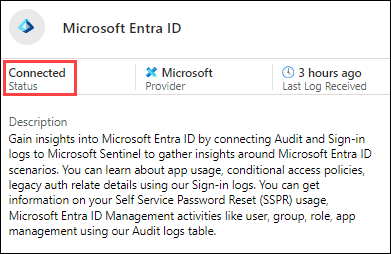
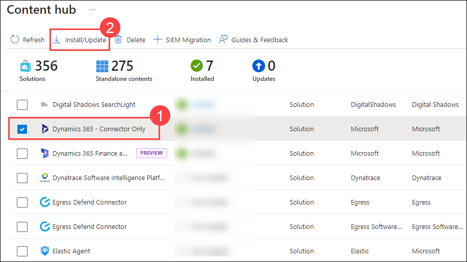
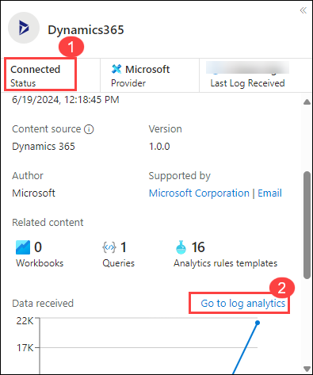
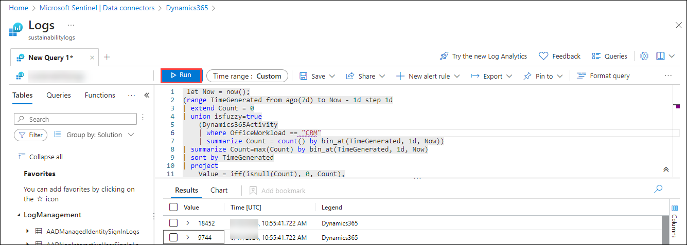
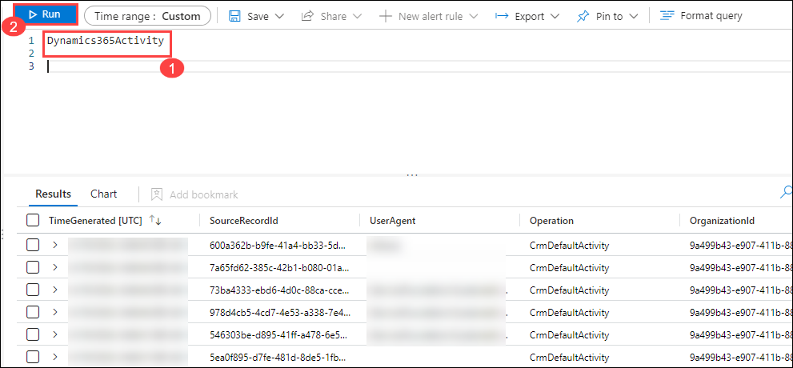

# Lab 7 : Security in Sustainability

## Lab Overview
This lab provides hands-on experience in configuring Microsoft Sentinel to establish a centralized workspace for monitoring security events that impact sustainability efforts. You will install and configure data connectors to ingest logs from Microsoft Entra ID and Dynamics 365, ensuring comprehensive monitoring and compliance with environmental standards. By the end of this lab, you will understand how to leverage Microsoft Sentinel to enhance security monitoring and response capabilities in alignment with sustainability goals.

## Lab Scenario
As an IT security specialist in a sustainability-driven organization, your role focuses on safeguarding environmental initiatives through robust security measures. This lab emphasizes setting up and configuring Microsoft Sentinel to monitor and analyze security events related to sustainability practices within the organization's cloud environment.

## Lab Objectives

In this lab, you will perform the following tasks to enhance security monitoring within a sustainability context:

- Exercise 1: Setup Sentinel Workspace
  - Task 1: Create Sentinel Workspace
- Exercise 2: Ingest Logs from Microsoft Entra ID
  - Task 1: Install Microsoft Entra ID data connector to Sentinel
  - Task 2: Set up the data connector to ingest logs to workspace
  - Task 3: View data ingested into Microsoft Sentinel
- Exercise 3: Ingest Logs from Dynamics 365
  - Task 1: Install Dynamics 365 connector to Sentinel
  - Task 2: Set up the data connector to ingest logs to workspace
  - Task 3: View data ingested into Microsoft Sentinel

## Estimated timing: 90 minutes

## Excercise 1 - Setup Sentinel Workspace

### Task 1: Create Sentinel Workspace

In this task, you will create a Microsoft Sentinel workspace where you will monitor and analyze security events.

1.  On Azure Portal page, in **Search resources, services and docs (G+/)** box at the top of the portal, enter **Microsoft Sentinel**, and then select **Microsoft Sentinel** under services.

    

1. From the Microsoft Sentinel page, select **+ Create**.

1. From Add Microsoft Sentinel to a workspace, select **+ Create a new workspace**.

1. From the basics tab of the Create Log Analytics workspace, enter the following and click **Review + Create**.   

    | Setting | Action |
    | -- | -- |
    | Subscription |  Retain the default Subscription.  |
    | Resource group | select **sustainability** |
    | Name | Set the name to **sustainabilityworkspace**. |
    | Region | Retain the default region. |
    |||

    

1. Verify the information you entered then select **Create**.

1. If you don’t see the new workspace listed, select **Refresh**, then select newly created workspace **sentinelworkspace** and click on **Add**.

1. Once the new workspace is added, the Microsoft Sentinel | News & guides page will display., including that the Microsoft Sentinel free trial is activated. Select **OK**  Note the three steps listed on the Get started page.

   
   
   

## Excercise 2 - Ingest Logs from Microsoft Entra ID

### Task 1: Install Microsoft Entra ID data connector to Sentinel

In this task, you will install the Microsoft Entra ID data connector in Microsoft Sentinel.

1. On Azure Portal page, in **Search resources, services and docs (G+/)** box at the top of the portal, enter **Microsoft Sentinel**, and then select **Microsoft Sentinel** under services.

     

1. Select **sentinelworkspace**.

1. Select the **Data Connectors(1)** under **Configuration** and select **Content hub(2)**.

     

1. Search and select the **Microsoft Entra ID** connector.

   

1. Click on **Install**.

### Task 2: Set up the data connector to ingest logs to workspace

In this task, you will configure the Microsoft Entra ID data connector to ingest logs into your Log Analytics workspace.

1. In Microsoft Sentinel, select Data connectors.

1. Search for and select the **Microsoft Entra ID** connector.

1. In the details pane for the connector, select Open connector page.

1. On the **Instructions** page, under configuration, select the required record types data to be collected and click on **Apply changes**

   

  >**Note**: Wait for atleast 15 mins and proceed to next task.

### Task 3: View data ingested into Microsoft Sentinel

In this task, you will verify the logs ingested from Microsoft Entra ID in the Sentinel workspace.

1. In Microsoft Sentinel, select Data connectors.

1. Search for and select the **Microsoft Entra ID** data connector.

1. In the details pane for the connector, select Open connector page.

1. Review the Status of the data connector. It should be Connected.

      

1. Scroll down and select **Go to log analytics**.

1. In the query pane, run the default query, to view the activity data ingested into the workspace.

      

  >**Note**: It might take upto **3hrs** to generate the activity logs.

# Excercise 3 - Ingest Logs from Dynamics365

### Task 1: Install Dynamics365 connector to Sentinel

In this task, you will install the Dynamics 365 data connector in Microsoft Sentinel.

1. On Azure Portal page, in **Search resources, services and docs (G+/)** box at the top of the portal, enter **Microsoft Sentinel**, and then select **Microsoft Sentinel** under services.

     

1. Select **sentinelworkspace**.

1. Select the **Data Connectors(1)** under **Configuration** and select **content hub(2)**.

     

1. Search and select the **Dynamics 365 - Connector Only** connector.

   

1. Click on **Install**.


### Task 2: Set up the data connector to ingest logs to workspace

In this task, you will configure the Dynamics 365 data connector to ingest logs into your Log Analytics workspace.

1. In Microsoft Sentinel, select Data connectors.

1. Search for and select the **Dynamics 365** connector.

1. In the details pane for the connector, select Open connector page.

1. On the **Instructions** page, under configuration, click on **Connect**

  >**Note**: Wait for atleast 15 mins and proceed to next task.

### Task 3: View data ingested into Microsoft Sentinel

In this task, you will verify the logs ingested from Dynamics 365 in the Sentinel workspace.

1. In Microsoft Sentinel, select Data connectors.

1. Search for and select the **Dynamics365** data connector.

1. In the details pane for the connector, select Open connector page.

1. Review the Status of the data connector. It should be Connected.

      

1. Scroll down and select **Go to log analytics**.

1. In the query pane, run the default query, to view the activity data ingested into the workspace.

      

  >**Note**: It might take upto **3hrs** to generate the activity logs.

1. In the query pane, run the below query, to view the in detail logs for Dynamics 365 activities.

```
Dynamics365Activity

```
      

  >**Note**: It might take upto **3hrs** to generate the activity logs. 

### Reference Link:
https://learn.microsoft.com/en-us/industry/sustainability/security-overview

## Review

By completing these exercises, you have acquired practical skills in leveraging Microsoft Sentinel for security monitoring in alignment with sustainability objectives, ensuring proactive security measures and regulatory compliance within the organization.

## You have successfully completed the lab. Click on Next >>.
