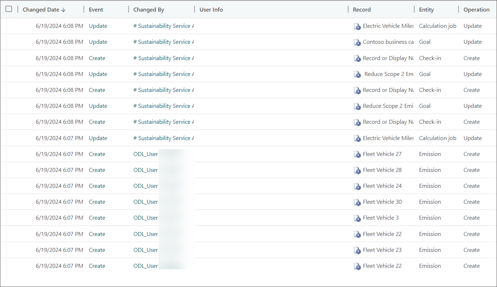
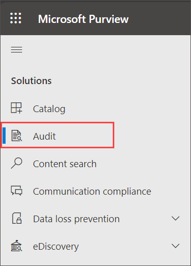

# Lab : Monitoring and Logging

## Lab scenario
As a sustainability manager using Microsoft Cloud for Sustainability, you are tasked with ensuring that sustainable practices are adhered to and that the organization complies with environmental regulations. One critical aspect of this role is monitoring and logging activities within your cloud environment. This lab will guide you through the process of enabling auditing, reviewing logs, and using Microsoft Compliance Center to monitor user and admin activities. By the end of this lab, you will have a comprehensive understanding of how to implement and utilize these tools to support your sustainability initiatives.

## Lab Overview

This lab provides a hands-on experience in configuring and utilizing monitoring and logging features within the Microsoft Cloud for Sustainability platform. You will learn how to:

   - Enable auditing to track activities within the environment.
   - Access and review audit logs to understand user and system actions.
   - Use Microsoft Compliance Center to conduct detailed audits and ensure compliance.

## Lab Objectives

   - Task 1: Enable auditing and logging in Microsoft Cloud for Sustainability.
   - Task 2: Review audit logs and summaries.
   - Task 3: Use Microsoft Compliance Center to monitor user and admin activities.

### Task 1: Enable auditing and logging in Microsoft Cloud for Sustainability.

In this task, you will enable auditing and logging within the Microsoft Cloud for Sustainability platform to track and record various activities

1. Login to https://admin.powerplatform.microsoft.com/ with following credentials:

   - **Email/Username:** <inject key="AzureAdUserEmail"></inject>
   - **Password:** <inject key="AzureAdUserPassword"></inject>

1. From the left navigation pane select **Environments** > **Sustainability Trial**.

   
    
1. From the top menu bar select **Settings**.

   

1. Expand **Audit and logs** then select **Audit settings**, under **Auditing** select check box next to **Start Auditing**, **Log access**  and **Read logs**.

   

    

### Task 2: Review audit logs and summaries

In this task, you will review audit logs and summaries within the Microsoft Cloud for Sustainability platform to understand user and system activities.

1. Back to **Settings** page, expand **Audit and logs** then select **Audit summary view** and review the data.

    

     

### Task 3: Use Microsoft Compliance Center to monitor user and admin activities

In this task, you will use the Microsoft Compliance Center to monitor user and admin activities. This involves starting recording activities, performing audit searches, and reviewing the audit logs.

1. Open another edge tab and browser to https://compliance.microsoft.com/ then from the left navigation pane under solution select **Audit**.

     

1. Click on **Start recording user and admin activity** on **Audit** page.

      

1. On the **Audit** under **New search** tab specify the following:

    - select **Start date** and **End date** 
    - **Record Type** : **CRM** and **PowerPlatformAdministratorActivity**
    - User : Search and select  **<inject key="AzureAdUserEmail"></inject>**
    - Click on **Search**

       

1. On the Audit Page refresh the page and monitor the status and wait until changes from **Queue > progress** to  **Completed**.

    

    

1. Then click on **Completed** link and you can view all the record

   

## Review

By following these steps, you will have successfully enabled monitoring and logging within Microsoft Cloud for Sustainability, reviewed audit summaries, and monitored user and admin activities.   

## You have successfully completed the lab. Click on Next >>.
